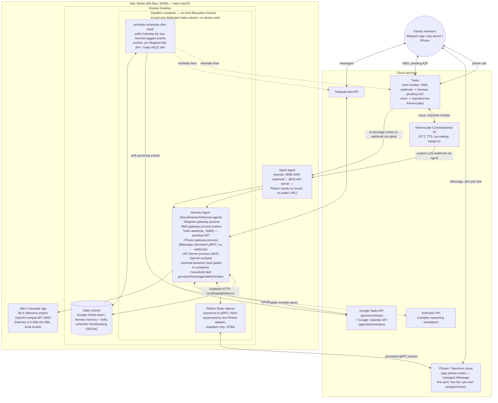
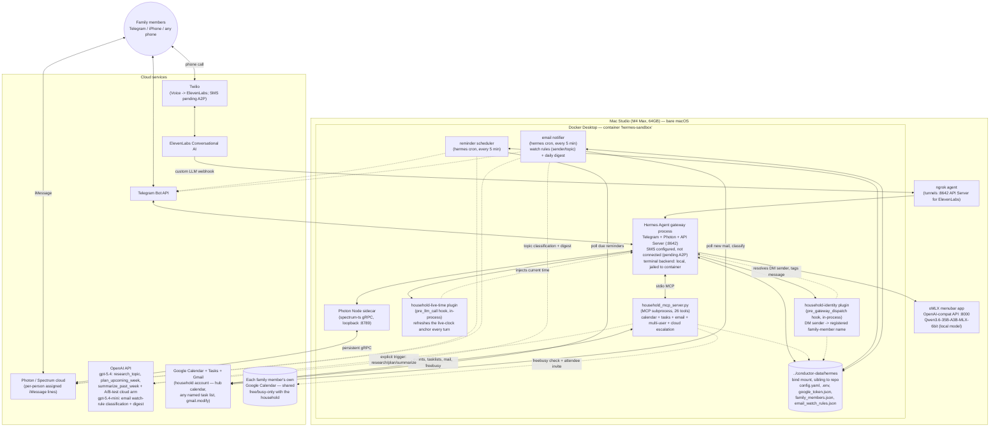

# Hermes Family Assistant — Architecture Plan

## Context

`conductor` is currently an empty scaffold (just `README.md` + `pyproject.toml`, Python ≥3.12). The README is a project brief describing a household AI assistant ("HermesBot") reachable over Telegram, SMS, and phone calls, built on **Hermes Agent** (NousResearch/hermes-agent), a real open-source agent framework, plus **oMLX** (omlx.ai), a real local-inference server for Apple Silicon. I confirmed both projects exist and pulled their actual capabilities from their docs rather than guessing, since the README's tech names map to specific real products with specific constraints.

Correcting my first pass: **Hermes Agent natively supports SMS via Twilio**, not just Telegram/Discord/Slack/etc. That removes the need for most of the custom "bridge" code I originally planned — the only genuinely custom software this project needs is the household data skill and a small reminder scheduler.

This plan defines the system architecture, component responsibilities, tech stack, and the external accounts to create before implementation starts. No code is written in this phase.

**Sources consulted:** [Hermes Agent docs](https://hermes-agent.nousresearch.com/docs/), [Hermes Agent GitHub](https://github.com/NousResearch/hermes-agent), [Hermes SMS docs](https://hermes-agent.nousresearch.com/docs/user-guide/messaging/sms), [Hermes API Server docs](https://hermes-agent.nousresearch.com/docs/user-guide/features/api-server), [Hermes Configuration docs](https://hermes-agent.nousresearch.com/docs/user-guide/configuration), [oMLX](https://omlx.ai/), [Hermes Agent × ElevenLabs integration article](https://youmind.com/landing/x-viral-articles/call-hermes-agent-eleven-agents).

---

## Key facts that shape the design

- **Hermes Agent** natively speaks Telegram, Discord, Slack, WhatsApp, Signal, Email, CLI, **and SMS via Twilio**. Each is its own gateway process (`hermes gateway ...`), started independently but sharing the same `~/.hermes` config/memory/skills. SMS runs Hermes's own webhook server (default port 8080, path `/webhooks/twilio`), strips markdown, splits messages over 1600 chars, and requires an explicit user allowlist.
- The one channel Hermes does **not** natively speak is **real-time phone voice**. For that, Hermes exposes an **API Server mode** (`hermes gateway`, OpenAI-compatible, default port 8642, bearer-token auth) — the full agent (memory, skills, tools) as a plain `/v1/chat/completions` endpoint. ElevenLabs' Conversational AI platform calls this directly as its "custom LLM," so Hermes still does 100% of the reasoning/tool-calling; ElevenLabs only owns the audio layer (STT, TTS, turn-taking, barge-in).
- Hermes takes cloud models as first-class providers (`model.provider: anthropic`, etc.) and a separate `auxiliary:` block for secondary/side-task models. There's no automatic complexity-based router — "local for routine, cloud for complex" means: **primary model = local via oMLX**, and a specific skill/tool path escalates to a cloud model when the agent (or a rule) decides a query needs it. (Written during initial research, before implementation — the actual cloud provider ended up being OpenAI, not Anthropic, and the escalation path ended up being direct API calls from custom tools rather than Hermes's own `model.provider`/`auxiliary:` mechanisms; see Decision 1 and Phase 8.)
- Hermes's own terminal/execution backend supports `local`, `docker`, `ssh`, `singularity`, `modal`, `daytona` — but running Hermes's `docker` backend *inside* our sandbox container would require mounting the host Docker socket in, which defeats the sandboxing goal. **One sandbox boundary, not two**: outer container = the jail, Hermes's internal terminal backend = `local` (scoped to that already-jailed filesystem).
- **oMLX** is a signed/notarized macOS menubar app, not a container — it must run bare-metal to get Metal/GPU access, exposing `http://127.0.0.1:8000/v1` (OpenAI- and Anthropic-compatible) by default (configurable).

---

## Architecture

> This diagram is the **original, pre-implementation** sketch from this planning phase — kept as-is for historical record rather than maintained as a living systems diagram (same reasoning as the strikethrough-and-note treatment used for superseded decisions below, e.g. Decision 1/2). It has since diverged in real ways: the `ANTHROPIC` node is OpenAI in practice (Decision 1, Phase 8), and it predates the household MCP server's actual tool set, the multi-user/family-registry mechanism, the local-vs-cloud A/B harness, and the `household-identity` plugin (all Phase 6–8b). See the current-architecture diagram below for what's actually running.

### Current architecture (as of Phase 11, 2026-07-28)

What the plan above became in practice — same overall shape (one sandbox container, oMLX bare-metal on the host, Google as the household data backend), but SMS never went live, Photon replaced it as the real interim/parallel text channel, the cloud-escalation provider is OpenAI rather than Anthropic and is invoked directly from custom tools rather than through Hermes's own provider config, and several capabilities the original plan didn't anticipate at all got added since: multi-user scheduling against family members' own Google calendars, a plugin that resolves DM sender identity, a second plugin that keeps relative-date reasoning correct across long-lived sessions, email (read/send/reply, watch rules, daily digest) as a second `hermes cron` job alongside the reminder scheduler, and a durability pass that moved Hermes's own state off a Docker-managed named volume.

### Component responsibilities

| Component | Runs where | Responsibility |
|---|---|---|
| **oMLX** | Bare-metal macOS (menubar app) | Serves the local model over an OpenAI-compatible API using Metal/GPU acceleration. Handles routine, private household queries by default. |
| **Hermes Agent — Telegram gateway** | Sandbox container | Native process for the Telegram bot: tool-use routing, skills, memory, markdown, group chat. |
| **Hermes Agent — SMS gateway** | Sandbox container | Native process handling Twilio's "message comes in" webhook directly (own webhook server on :8080). No custom code needed here at all. **Pending A2P 10DLC registration (in progress offline) — not yet live.** |
| **Hermes Agent — Photon gateway (iMessage)** | Sandbox container | Native process; persistent gRPC connection to Photon's Spectrum cloud via the Node sidecar — no webhook, no public URL, no ngrok. Free tier: each family member is registered individually (`hermes photon setup --phone <E.164>`) and gets their own assigned iMessage line from Photon's shared pool, not one shared household number. |
| **Photon Node sidecar** | Sandbox container, loopback :8789 | Small supervised Node process running the `spectrum-ts` SDK (TypeScript-only) — bridges the Python gateway to Photon's gRPC stream. Started/restarted/killed by the Python adapter; never invoked directly. |
| **Hermes Agent — API Server** | Sandbox container, :8642 | Exposes the same agent as an OpenAI-compatible endpoint — the integration seam for ElevenLabs voice. |
| **household MCP server** (`household/household_mcp_server.py`, custom, this repo) | Sandbox container, stdio MCP subprocess | 26 tools, superseding the originally-planned agentskills.io skill (see Phase 6's architecture-change note): `get_agenda`/`add_calendar_event`/`set_reminder`/`update_calendar_event`/`delete_calendar_event`/`search_calendar_events`/`suggest_meeting_time`/`list_family_members` (calendar + multi-user), `list_task_lists`/`add_list_item`/`set_due_date`/`remove_list_item`/`complete_list_item`/`list_items`/`create_task_list`/`delete_task_list` (generic across any named list, not just groceries/chores), `search_emails`/`read_email`/`send_email`/`reply_to_email`/`add_email_watch_rule`/`list_email_watch_rules`/`remove_email_watch_rule` (Gmail, Phase 11), and `research_topic`/`plan_upcoming_week`/`summarize_past_week` (cloud escalation). |
| **household-identity plugin** (`household/plugins/household_identity/`, custom, this repo) | Sandbox container, in-process Hermes plugin | `pre_gateway_dispatch` hook: resolves an authenticated DM sender's Telegram ID / Photon phone number against `family_members.json` and rewrites the message with a `[Name]` prefix, so "add this for me" resolves the same way a named third party does. DM-only; group chats already get Hermes's own sender-tagging. |
| **household-live-time plugin** (`household/plugins/household_live_time/`, custom, this repo) | Sandbox container, in-process Hermes plugin | `pre_llm_call` hook: re-injects the current date/time on every turn, working around Hermes caching the session's system prompt (with its one-time date anchor) for the life of a long-lived Telegram/Photon session — without this, relative dates ("today", "in 5 days") silently drift once a session spans midnight (Phase 6 update, root-caused from a 2026-07-27 incident). |
| **Google Tasks + Calendar + Gmail API** | Cloud | The actual list/calendar/mail backend behind the household MCP server, all on one dedicated household Google account (`roseyfamilyconductor@gmail.com`). Official OAuth APIs (`calendar`, `tasks`, `gmail.modify` scopes), works with a personal Gmail account (unlike the Google Keep API, which is Workspace-only). |
| **reminder scheduler** (`household/reminder_scheduler.py`, custom, this repo) | Sandbox container, `hermes cron` job, every 5 min | The one piece of proactive-push logic nothing else provides: Google Calendar can notify the account owner, but it can't push into Telegram/iMessage. Polls Calendar for due Hermes-tagged reminders (looking a full poll interval ahead and sleeping to the exact second for on-time delivery) and pushes each one via `hermes send` to whichever channel (`telegram` or `photon`) the reminder was set with, then marks it sent. |
| **email notifier** (`household/email_notifier.py`, custom, this repo) | Sandbox container, `hermes cron` job, every 5 min | Mirrors the reminder scheduler's shape (Phase 11): matches new mail against user-defined watch rules (`add_email_watch_rule` — plain address comparison for sender rules, a batched cloud classification call via `gpt-5.4-mini` for topic rules) and separately pushes a once-daily digest, both via the same `hermes send`-based delivery the reminder scheduler uses. Deliberately not built on Hermes's own bundled email-platform plugin, which always auto-replies via email with no "just notify a different channel" mode. |
| **ElevenLabs Conversational AI** | Cloud | Owns the real-time voice layer end-to-end: STT, ultra-realistic TTS, turn-taking, barge-in. Its "custom LLM" endpoint points at Hermes's API Server (via ngrok) — Hermes does all the reasoning/tool-calling, ElevenLabs never touches household data directly. |
| **ngrok** | Host (or a thin sidecar) | Public HTTPS tunnel(s) terminating at the container's SMS-webhook port (:8080) and API Server port (:8642), since Twilio and ElevenLabs both need a public URL to reach the sandboxed container. **Not used by Photon** — its gRPC connection is outbound-only from the sidecar, no inbound public endpoint required. |
| **Docker** | Host | The single sandbox boundary. No bind mount of `~/Documents`, iCloud Drive, Time Machine, or any host user directory — only the dedicated `/data` mount, itself now a bind mount to a sibling directory (`../conductor-data/hermes`, not a Docker-managed named volume — see the durability pass below) rather than the user's own folders. No Docker socket mounted in. |

### How each README scenario maps onto this

- **Scenario 1 (Telegram group)** — Telegram → Hermes Telegram gateway (native) → household skill → Google Tasks → markdown reply.
- **Scenario 2 (Voice, barge-in)** — Twilio Voice (number imported into ElevenLabs) → ElevenLabs owns audio + barge-in → custom-LLM callback → Hermes API Server (via ngrok) → household skill → response text → ElevenLabs TTS.
- **Scenario 3 (SMS fallback)** — Twilio SMS webhook → ngrok → Hermes's native SMS gateway → household skill → Hermes sends the TwiML/REST reply itself. No custom bridge code. **Pending A2P 10DLC registration** (started offline, days-long carrier process) — see Decision 6. In the meantime, **iMessage via Photon** serves as the interim text channel for Apple-device family members: no ngrok/webhook needed (persistent gRPC), but it doesn't fully satisfy this scenario's "no smartphone data plan" framing (iMessage requires an iPhone) — true SMS remains the target once A2P clears.
- **Scenario 4 (sandboxed script execution)** — Hermes's `terminal: local` backend runs *inside* the already-jailed container; no host directory is ever mounted in.

---

## Decisions (resolved)

1. **Cloud LLM provider:** ~~Anthropic. Native first-class provider in Hermes (`model.provider: anthropic` + `ANTHROPIC_API_KEY`) — wired in as the escalation target for complex reasoning, no custom `base_url` needed.~~ **Superseded in Phase 8 (2026-07-26) — switched to OpenAI** (`gpt-5.4`) to use the household's free daily OpenAI token allowance. Implemented as direct calls from custom tools (`household/household_mcp_server.py`), not Hermes's own `model.provider`, which stays local/oMLX — see Phase 8 for the full mechanism and why.

2. **Local model recommendation:** ~~Hermes-4-14B, MLX 8-bit quantization~~ **superseded — see Phase 2 update below.** Original reasoning kept for the record:
   - It's Nous Research's own agentic/tool-calling fine-tune — the same team that builds Hermes Agent — so its function-calling behavior is a strong match for Hermes's tool-use routing.
   - 14B at 8-bit is ≈15GB resident, comfortably inside your 64GB unified memory budget alongside macOS, Docker, and a large context window/KV cache — with real headroom left over, unlike a 32B-class model at 8-bit (~35GB+) which would leave the system tight once Docker and context are added.
   - Sits centrally in the README's stated 12B–32B target range rather than pushing the top of it.
   - **Alternative** if you want a stronger generalist at the cost of more memory headroom: a ~27B–32B dense or MoE model (e.g. current Qwen3.x-class 4-bit MLX build, ~18–20GB) — worth A/B testing against Hermes-4-14B once both are running, but start with Hermes-4-14B.

   **Update (Phase 2, 2026-07-25):** Hermes-4-14B-8bit's native context window is 40,960 tokens (`max_position_embeddings` in its `config.json` — this is the model's real ceiling, not an oMLX under-report). Hermes Agent hardcodes `MINIMUM_CONTEXT_LENGTH = 64_000` (`agent/model_metadata.py`) and refuses to start below it, so Hermes-4-14B is disqualified outright — this wasn't visible until Phase 2 tried an actual `hermes -z` call against it.
   - **Local model, revised: Hermes-4.3-36B-mlx-5Bit** — newly downloaded, native context 524,288 (well clear of the floor), confirmed working end-to-end from inside the sandbox container in Phase 2.
   - **Next comparison point:** ~~**Qwen3.6-35B-A3B-MLX-6bit** — also newly downloaded, 262,144 native context, MoE (~3B active params/token, so inference cost tracks closer to a small model despite the 35B total). This was the plan's original "Alternative" line, now promoted to a real A/B candidate against Hermes-4.3-36B rather than against the disqualified Hermes-4-14B. Not yet tested — planned for after Hermes-4.3-36B is exercised through Phase 3+.~~ **Update: tested and promoted to the active production model, carried into Phase 3+** (see Phase 2's "Carried into Phase 3+" note below) — basic-chat sanity check passed, config-swap path confirmed clean. The formal head-to-head comparison against Hermes-4.3-36B (tool-calling behavior specifically) never happened separately; Qwen has simply been the model in production use since Phase 2, and Hermes-4.3-36B remains downloaded but unused. If a rigorous local-vs-local comparison matters later, `household/ab_test/` (built in Phase 8 for local-vs-cloud) could be pointed at it with minimal changes — it wasn't designed for this but the mechanics (fixed script, latency capture, LLM judge) transfer.

3. **Voice bridging pattern:** Import the Twilio number directly into the ElevenLabs Agent (simplest — ElevenLabs owns the Voice webhook automatically).
   - **On your SMS question:** yes, this should still work. Twilio phone numbers have two *independent* webhook slots — "A call comes in" (Voice) and "A message comes in" (Messaging/SMS). ElevenLabs' number-import feature only configures the **Voice** slot; it has no reason to touch Messaging. So the same number can have its Voice webhook owned by ElevenLabs and its Messaging webhook pointed at Hermes's native SMS gateway (via ngrok) at the same time.
   - **One verification step to do at implementation time:** after importing the number into ElevenLabs, open the Twilio Console for that number and confirm the Messaging webhook is still set (or set it) to Hermes's SMS webhook URL — don't assume the import left it alone without checking.

4. **Process layout:** One container. Hermes's Telegram gateway, SMS gateway, and API Server all run as separate processes inside a single sandbox container, sharing one `~/.hermes` config/memory/skills directory and the mounted `/data` volume. The reminder scheduler runs as a fourth lightweight companion process in the same container. Hermes never runs on the bare host — the Docker sandbox from Scenario 4 is non-negotiable, so it's the environment used from the very first working Hermes setup, not bolted on afterward. (Written before Phase 4's channel substitution — in practice the live gateway processes are Telegram, **Photon** (not SMS, which is still pending A2P — Decision 6), and API Server; same "separate processes, one container" shape, different channel set than originally planned here.)

5. **Household data backend:** **Google Tasks + Google Calendar** (official OAuth APIs) instead of Google Keep or a local-only SQLite store.
   - Google Keep's *official* API exists but is restricted to Google Workspace (Business/Enterprise/Education) accounts — it doesn't work with a personal Gmail account. The unofficial `gkeepapi` library works with personal accounts but is reverse-engineered, unsupported by Google, can break without notice, and requires storing Google account credentials inside the sandbox — in tension with the README's own privacy/security priority.
   - Google Tasks (lists/checklists) and Google Calendar (events/agenda) are official, OAuth-based, fully supported on personal Gmail, and let family members see/edit the same data in apps they already use.
   - Trade-off accepted: this means the household data itself lives in Google's cloud, not purely locally — a deliberate deviation from "keep private household data local" in exchange for reliability and using tools the family already has. If fully local storage turns out to matter more once this is running, the household skill can be swapped back to local SQLite later without touching any other component.

6. **Phase 4 messaging channel: Photon (iMessage, free tier) now, Twilio SMS deferred.** (2026-07-25)
   - The Twilio number acquired for SMS turned out to need **A2P 10DLC carrier registration** before it can reliably send outbound messages (inbound is generally unaffected, but replies risk silent carrier filtering without it). Registration was started, but is a days-long offline process — not something to block Phase 4 on.
   - Explored two Hermes-native alternatives for the interim: **BlueBubbles** (self-hosted, runs on your own Mac, fully local data flow) and **Photon** (managed cloud service, `photon.codes`). BlueBubbles was ruled out because it bridges through whatever Apple ID is already signed into Messages.app on the host Mac — the user actively uses iMessage on that machine and didn't want to give Hermes that identity or sign out of their own account.
   - **Photon free tier chosen**, with a real limitation surfaced and accepted: Photon's free/Pro tiers use a **shared iMessage line pool** — each family member is individually registered (`hermes photon setup --phone <E.164>`) and assigned their *own* number from the pool, not one shared household number. A single dedicated number that the whole household texts requires Photon's **Business tier ($250/line/month)** — judged disproportionate for this project and explicitly rejected. Consequence: onboarding a new family member is manual (the operator runs the CLI, then hands that person their assigned number out of band) rather than self-serve like Telegram's public bot username.
   - Photon needs no ngrok/public webhook at all (persistent outbound gRPC via a supervised Node sidecar) — architecturally simpler than both SMS and Voice in that respect.
   - Trade-off accepted, same category as Decision 5: Photon is a third-party cloud service mediating household messages, not fully local — a deliberate deviation from "keep private data local," accepted for the same reasons (reliability, avoiding reverse-engineered alternatives, avoiding real cost). **Twilio SMS remains the target for README Scenario 3's "no smartphone data plan" case** once A2P registration clears — Photon does not replace that use case, since iMessage requires an iPhone.

---

## Tech stack

- **Host OS/hardware:** macOS on Mac Studio M4 Max, 64GB unified memory
- **Local inference:** oMLX (omlx.ai) — bare-metal menubar app, OpenAI-compatible API on `:8000` (default, confirm on your install), running **Qwen3.6-35B-A3B-MLX-6bit** (the currently active model as of Phase 2's end — see Decision 2 update; `Hermes-4.3-36B-mlx-5Bit` also downloaded, queued as a *local-model-vs-local-model* A/B comparison, not yet run — distinct from the local-vs-cloud A/B harness built in Phase 8)
- **Agent core:** Hermes Agent (`NousResearch/hermes-agent`), Python/uv-based, MIT licensed — Telegram, Photon (iMessage), and API Server gateway processes live; SMS gateway process supported but not yet live (pending A2P 10DLC, Phase 4b)
- **Cloud LLM (complex-reasoning escalation):** OpenAI — `gpt-5.4` for `research_topic`/`plan_upcoming_week`/`summarize_past_week` (via the household's free daily token allowance), `gpt-5.4-mini` for the email notifier's watch-rule classification and daily digest (Phase 11) — called directly from custom tools, not Hermes's own provider config (see Phase 8)
- **Containerization:** Docker Desktop for Mac, docker-compose for the sandbox container and the `~/.hermes` bind mount (`../conductor-data/hermes`, sibling to this repo — see the Phase 6/durability-pass note below)
- **Custom code (this repo):** Python 3.12 — the household MCP server (`household/household_mcp_server.py`, 26 tools: calendar, tasks, email, multi-user scheduling, cloud escalation), the reminder scheduler process, the email notifier process (`household/email_notifier.py`, Phase 11), two Hermes plugins — DM sender-identity resolution (`household/plugins/household_identity/`, Phase 8b) and live-clock injection (`household/plugins/household_live_time/`, Phase 6 update) — and a local-vs-cloud model A/B benchmarking harness (`household/ab_test/`, Phase 8)
- **Household data store:** Google Tasks API (grocery list, chores, and any ad-hoc list) + Google Calendar API (agenda, events, reminders) + Gmail API (search/send/reply, `gmail.modify` scope, Phase 11), via OAuth against one dedicated household Google account; a small SQLite file on the bind-mounted `~/.hermes` directory for the reminder/email schedulers' own bookkeeping and Hermes's memory/skills state
- **Channels:**
  - Telegram Bot API (via BotFather token) — native Hermes gateway
  - Twilio Programmable SMS — native Hermes gateway — **pending A2P 10DLC registration** (Decision 6)
  - Photon (Spectrum SDK, free tier) — native Hermes gateway, managed iMessage — **active as of Phase 4**, interim channel while SMS registration is pending (Decision 6)
  - Twilio Programmable Voice, number imported into ElevenLabs
  - ElevenLabs Conversational AI (Agents Platform) — STT/TTS/turn-taking/barge-in, custom-LLM webhook into Hermes's API Server
- **Network ingress:** ngrok tunnel(s) exposing the container's SMS-webhook port (:8080) and API Server port (:8642) publicly. Photon needs no tunnel — persistent outbound gRPC only.

---

## Accounts to create

| # | Account | Why | Notes |
|---|---|---|---|
| 1 | **Telegram** (BotFather) | Create the household bot + token | Free, needs an existing Telegram account |
| 2 | **Twilio** | One SMS+Voice-capable phone number, Account SID/Auth Token | Same number serves both SMS (via Hermes) and Voice (via ElevenLabs). **SMS side blocked on A2P 10DLC registration** (in progress offline, days-long) — Voice use is unaffected. |
| 3 | **Photon** (`photon.codes`) | Managed iMessage integration, free tier | `hermes photon setup --phone <E.164>` per family member — device-login OAuth via browser, no payment needed on free tier. Re-run per person to onboard each family member individually (see Decision 6 for the per-user-number limitation). |
| 4 | **ElevenLabs** | Conversational AI (Agents Platform) API key | Confirm the plan tier includes phone/Twilio number import and enough conversational minutes |
| 5 | **ngrok** | Auth token; a **reserved/static domain is recommended** (paid) | A free ephemeral URL changes on every restart, breaking the Twilio/ElevenLabs webhook config each time. Not needed for Photon. |
| 6 | **OpenAI** | API key for the complex-reasoning escalation path (Phase 8) | Standard OpenAI Platform account + API key — the household has a free daily token allowance, which is why this replaced the originally-planned Anthropic provider |
| 7 | **Google Cloud project** | OAuth client for Google Tasks API + Google Calendar API | Enable both APIs in Google Cloud Console, create an OAuth 2.0 client, complete the consent flow once against the family Gmail account (or a dedicated household Google account) to get a refresh token |
| 8 | **Hugging Face** (conditional) | Only if downloading a gated model | Hermes-4.3-36B-mlx-5Bit and Qwen3.6-35B-A3B-MLX-6bit were both downloaded directly through oMLX with no gating hit — not needed so far |

---

## Implementation Roadmap

Each phase is a working, demoable milestone — nothing is built until the layer under it is verified. Hermes runs in Docker starting with Phase 2 and never on the bare host; channels and integrations are then added one at a time so a failure is always traceable to the thing that just changed.

### Phase 1 — Local model foundation (no Hermes, no Docker yet) — ✅ COMPLETE (2026-07-25)
- Install oMLX on the Mac Studio, pull `NousResearch/Hermes-4-14B` MLX 8-bit build, load it. Confirm the port it's actually listening on (default `:8000`, but verify against your install rather than assuming).
- **Done when:** `curl http://127.0.0.1:8000/v1/chat/completions` returns a real completion from the host.
- **Verified:**
  - `lsof`/`ps` confirmed `omlx-server` listening on `127.0.0.1:8000` — the documented default held, no override needed.
  - `GET /v1/models` shows `Hermes-4-14B-8bit` loaded and served alongside several other local models (Kokoro TTS, Whisper/Parakeet STT, a few smaller Llama/Qwen models) — oMLX is hosting a multi-model menu, not just the one model, worth remembering for later phases (e.g. STT/TTS options already sitting on the same box).
  - `POST /v1/chat/completions` with model id `Hermes-4-14B-8bit` returned a real, coherent completion (2.9s, 32 completion tokens, `finish_reason: stop`).
  - Note for Phase 2 config: the model id to put in Hermes's `model.name` (once we point Hermes's `custom` provider at oMLX) is `Hermes-4-14B-8bit`, not the bare `Hermes-4-14B` used in the plan doc — oMLX suffixes the quant.
  - **Superseded in Phase 2:** `Hermes-4-14B-8bit` turned out to have a native 40,960-token context window, below Hermes Agent's hardcoded 64K minimum — it never actually got used past this smoke test. See Decision 2's Phase 2 update and Phase 2 below.

### Phase 2 — Hermes Agent core, in Docker from the start — ✅ COMPLETE (2026-07-25)
- Hermes never runs on the bare host (per Decision 4). Stand up the sandbox container per the architecture — `/data` volume only, no host directory mounts, no `docker.sock`, terminal backend `local` — and install/configure Hermes Agent inside it. Configure `model.provider: custom` / `base_url` pointing at oMLX via `host.docker.internal:8000`.
- Hold a conversation via `hermes chat` (or equivalent CLI) inside the container, with no channels, no skills, no cloud fallback wired in yet.
- **Done when:** the CLI agent answers questions from inside the container using *only* the local model, **and** `ls ~/Documents` (or similar) from inside the container confirms it cannot see the host filesystem — the Scenario 4 isolation guarantee, verified from day one rather than bolted on later.
- **Built:**
  - `Dockerfile` (repo root) — `debian:bookworm-slim`, non-root `hermes` user, official Hermes Agent install script (`hermes-agent.nousresearch.com/install.sh`) run non-interactively.
  - ~~`docker-compose.yml` (repo root) — single named volume `hermes_data` mounted at `/home/hermes/.hermes` (this **is** the architecture doc's `/data` volume: config, memory, skills, and later the OAuth token + scheduler SQLite).~~ **Superseded — durability pass (2026-07-27):** switched from the named volume to a bind mount at `../conductor-data/hermes` (sibling to this repo, not a subdirectory of it — a gitignored subdirectory is one `git clean -fdx` away from deleting session history and the OAuth token). Motivated by discovering the named volume held real, un-backed-up data (`state.db` session/memory history, `google_token.json`, and a hand-tuned `config.yaml` that `docker/hermes-config.yaml` had drifted years behind, still frozen at this phase's minimal version). Not the "no bind mounts of host directories" case this phase's own done-when guarded against — that guarantee was about the sandboxed agent never reaching the *user's* files (`~/Documents`, iCloud Drive), re-verified unchanged after the switch; this mount holds only Hermes's own state, identical in content to what the named volume held. No `docker.sock`, still. `host.docker.internal` reachable natively on Docker Desktop for Mac.
  - `docker/hermes-config.yaml` — `model.provider: custom`, `base_url: http://host.docker.internal:8000/v1`, `terminal.backend: local`.
- **Verified:**
  - `hermes doctor` inside the container confirmed the terminal backend itself, unprompted: *"Running inside a container — using local terminal backend (docker-in-docker is not configured by default)"* — matching Decision 4/the plan's "one sandbox boundary, not two" reasoning exactly.
  - First attempt (`Hermes-4-14B-8bit`) failed hard at `hermes -z`: `agent failed: Model Hermes-4-14B-8bit has a context window of 40,960 tokens, which is below the minimum 64,000 required by Hermes Agent`. Confirmed via the model's own `config.json` (`max_position_embeddings: 40960`) that this is the model's real ceiling, not a server under-report — so Hermes-4-14B was disqualified rather than patched around with a fake `model.context_length` override. See Decision 2 update.
  - User downloaded two replacement candidates directly into oMLX: `Hermes-4.3-36B-mlx-5Bit` (524,288 context) and `Qwen3.6-35B-A3B-MLX-6bit` (262,144 context). Switched config to `Hermes-4.3-36B-mlx-5Bit`.
  - `hermes -z "In one short sentence, what model are you and who is serving you?"` from inside the container returned: *"I am Hermes-4.3-36B-mlx-5Bit, and I am serving myself as I'm currently running on my own local provider."* — real completion, local model only, no channels/skills/cloud configured.
  - Isolation checks, all passed: `ls ~/Documents` → no such file or directory; `ls /var/run/docker.sock` → no such file or directory; `mount` shows only the container's own overlay filesystem, nothing from the host.
- **Carried into Phase 3+:** switched `docker/hermes-config.yaml` to `Qwen3.6-35B-A3B-MLX-6bit` and re-ran the same basic smoke test — `hermes -z "In one short sentence, what model are you and who is serving you?"` correctly returned *"I'm Hermes Agent, running on a Qwen3.6-35B-A3B-MLX-6bit model served via a custom provider."* Confirms the config swap path works cleanly (edit `docker/hermes-config.yaml` → `docker cp` into the running container's `~/.hermes/config.yaml`, no rebuild needed). The real A/B — tool-calling behavior under the household skill — still awaits Phase 6 (moved post-voice, see reordering note below); this was just a basic-chat sanity check. **Qwen3.6-35B-A3B-MLX-6bit is now the active configured model** pending that comparison.

**Reordering note (2026-07-25):** Household skill and reminder scheduler were originally Phases 3 and 5 — moved to Phases 6 and 7, after all three channels (Telegram, SMS, Voice) are proven with plain local-model conversation. Rationale: get the harder infrastructure integrations (especially ElevenLabs voice/barge-in) validated early against a known-good local model, before adding the custom household business logic on top. Consequence: Telegram/SMS/Voice's done-when criteria below now check channel plumbing only (message/call in, coherent reply out) — the household-data checks that used to live in each of those phases (grocery item via Telegram, grocery/calendar parity via SMS, "answer sourced from the household skill" via voice) are consolidated into a single cross-channel integration pass at the end of Phase 6, once household data actually exists to check. The reminder scheduler moved with the household skill since it has nothing to poll (no Google Calendar) until that phase runs.

**Channel substitution note (2026-07-25, Decision 6):** Phase 4's channel changed from SMS to iMessage via Photon — SMS itself split off into deferred Phase 4b, blocked on A2P 10DLC registration (external, days-long, in progress offline). Phase 6's cross-channel integration pass (below) checks Telegram + Photon + Voice for now; the SMS leg of that check gets folded in once Phase 4b unblocks, rather than holding up Phase 6.

### Phase 3 — Telegram integration (Scenario 1, channel plumbing only) — ✅ COMPLETE (2026-07-25)
- Create the bot via BotFather, configure Hermes's native Telegram gateway process, start it alongside the CLI-tested config.
- **Done when:** a real Telegram message gets a coherent reply generated by the local model — no household data involved yet, this is purely proving the gateway process works.
- **Built:**
  - Bot created via BotFather (`@FamilyConductorBot`); token + numeric allowed-user ID collected.
  - Repo-root `.env` (gitignored) holds `TELEGRAM_BOT_TOKEN` / `TELEGRAM_ALLOWED_USERS` as the source of truth; `docker/sync-env.py` merges it into the container's `~/.hermes/.env` in place (replacing commented template lines, preserving everything else) via `docker cp` + exec — no secret ever appears on a host command line or in shell history.
  - `docker-compose.yml`: added `sysctls: net.ipv6.conf.all.disable_ipv6=1`.
- **Verified / debugged:**
  - First connection attempts appeared to hang forever at "Connecting to Telegram (attempt 1/8)…" with no further console output. Root-caused to **two separate issues**, not one:
    1. **Real bug:** the container's default Docker Desktop bridge network answers AAAA (IPv6) queries for external hosts but has no real IPv6 egress (`curl -6` failed instantly, `curl -4` worked). Fixed by disabling IPv6 at the kernel level inside the container (see Built, above) — matters for Twilio/ElevenLabs in later phases too, not just Telegram.
    2. **Test-harness artifact, not a real hang:** even after the IPv6 fix, `docker exec ... | timeout 90 hermes gateway run 2>&1` still only ever showed that one console line. The actual `~/.hermes/logs/gateway.log` proved the gateway connects successfully in ~11s every time ("Connected to Telegram (polling mode)") — the CLI's console rendering simply wasn't flushing further output through a non-TTY piped `docker exec`, before my `timeout` wrapper killed the process. Lesson: **trust `~/.hermes/logs/gateway.log`, not piped console output, when diagnosing this gateway.**
  - Started for real via `docker exec -d hermes-sandbox hermes gateway run`; `hermes gateway status` confirmed `✓ Gateway is running`.
  - **User sent a live Telegram message and confirmed a coherent reply** — Phase 3's done-when, met with a real phone, not just `hermes -z`.
  - Reviewed the actual authorization source (`gateway/authz_mixin.py`) rather than trusting docs alone: `TELEGRAM_ALLOWED_USERS` is enforced at message intake, *before* the agent/LLM/tools are invoked — an unauthorized sender is logged and dropped, never reaching the local model or household data. Noted for later: group chats need `TELEGRAM_GROUP_ALLOWED_CHATS` (a separate variable) once the bot joins the family group; the framework's separate "DM pairing" self-enroll path exists but is unused and unaudited — flagged for the Phase 9 hardening pass, not a blocker now.
  - **Update (2026-07-27) — quote-reply UI turned off.** A turn needing a tool call was showing two Telegram bubbles for one reply: mid-turn commentary (sent via a separate, never-threaded delivery path) plus the final response (threaded/quote-replying the trigger message under the default `reply_to_mode: "first"`) — inconsistent, and the quoting itself wasn't wanted at all. Set `platforms.telegram.reply_to_mode: "off"` in `config.yaml`, confirmed via the adapter's own `_reply_to_message_id_for_send` logic and a live restart (`Shutdown notification suppressed`-style confirmation isn't applicable here, but the parsed `GatewayConfig` was checked directly: `reply_to_mode: off`) — both cases now render as plain, unquoted replies.

### Phase 4 — iMessage integration via Photon (Scenario 3 interim, channel plumbing only) — ✅ COMPLETE (2026-07-25)
- **Replaces SMS as the Phase 4 channel** — see Decision 6. Twilio's number needs A2P 10DLC carrier registration before it can reliably send outbound SMS; registration was started offline (days-long process) and SMS itself moves to Phase 4b below, to be picked up whenever that clears.
- Run `hermes photon setup --phone <E.164>` (device-login OAuth via browser, provisions the Photon project, registers the operator's number, installs the Node sidecar). No ngrok/webhook needed — persistent gRPC.
- **Done when:** a real iMessage to the operator's assigned Photon line gets a coherent reply generated by the local model — no household data involved yet, same plumbing-only bar as Telegram/SMS.
- **Built / debugged:**
  - The `photon-platform` bundled plugin ships **disabled by default** (`hermes plugins list` showed `not enabled`). `hermes plugins enable photon-platform` appeared to work but actually wrote the wrong key to `config.yaml` (`platforms/photon` instead of the real manifest key `photon-platform`) — confirmed via `HERMES_PLUGINS_DEBUG=1`, which showed the plugin being skipped with `not in plugins.enabled` until the key was hand-corrected. Root cause looks like a bug in the enable command's key resolution, not something we misconfigured.
  - Even after the plugin loaded correctly (`Registered deferred platform loader: photon`), the standalone `hermes photon setup --phone <E.164>` CLI subcommand still failed with `invalid choice: 'photon'` — the platform registration and the CLI-subcommand registration are two separate calls in the plugin's `register(ctx)`, and only the first one was taking effect. Worked around it via the documented alternate path: `hermes gateway setup`, the unified onboarding wizard, which does surface Photon correctly.
  - `hermes gateway setup` is a full-screen interactive TUI (raw-mode ANSI, arrow-key navigation) with no non-interactive/scriptable mode. Installed `tmux` in the container and drove it programmatically — `tmux new-session -d`, `send-keys` for navigation/selection/text entry, `capture-pane` to read state after each step — the same loop a human would run, just scripted.
  - First device-login code expired before it could be approved (Photon's device-flow codes are short-lived); the wizard doesn't reissue a new code on retry within the same failed attempt, so the fix was starting a **fresh** `hermes gateway setup` run to get a new code, approved promptly on the second try.
  - Setup completed all 5 steps: device login → project created → Spectrum credentials provisioned → phone registered (confirmed already-registered from the user's prior Photon dashboard setup) → Node sidecar (`spectrum-ts`) installed via `npm ci`. `PHOTON_PROJECT_ID`/`PHOTON_PROJECT_SECRET`/`PHOTON_ALLOWED_USERS`/`PHOTON_HOME_CHANNEL` all landed in `~/.hermes/.env` correctly.
  - Restarted the gateway (`hermes gateway stop` then a fresh `hermes gateway run`) to pick up the new platform — `gateway.log` confirmed `✓ telegram connected`, `✓ photon connected`, sidecar listening on loopback `127.0.0.1:8789`, `Gateway running with 2 platform(s)`.
  - **User sent a live iMessage to the assigned Photon line and confirmed a coherent reply** — Phase 4's done-when, met with a real phone. (The assigned number itself isn't recorded here — treated as PII-adjacent like the operator's own phone number, not committed to this doc.)
- **Latency investigated, improvement deferred to Phase 9** — see that section below.

### Phase 4b — SMS integration (Scenario 3, deferred pending A2P 10DLC)
- **Not yet started — blocked on an external, days-long carrier registration process, not on any implementation work.** Deliberately not renumbered into the main sequence so later phases don't need to shift again once this becomes unblocked.
- Once A2P 10DLC registration clears: ngrok tunnel to the container's `:8080`, point the Twilio number's Messaging webhook at Hermes's native SMS gateway.
- **This will run after Phase 5 (Voice)**, on the *same* Twilio number Phase 5 configures for Voice — per Decision 3, Voice and Messaging are independent webhook slots on one number, but the ElevenLabs number-import step (Phase 5) only touches the Voice slot deliberately. When this phase resumes: **verify in the Twilio Console that the Voice webhook from Phase 5 is still pointed at ElevenLabs** before/after setting the Messaging webhook — don't assume configuring one slot leaves the other alone without checking.
- **Done when:** a text to the household number gets a plain-text reply from the local model, confirming the same functionality originally scoped for this slot.

### Phase 5 — Voice integration (Scenario 2, channel plumbing only) — ✅ COMPLETE (2026-07-26)
- Enable Hermes's API Server process (`:8642`), stand up an ElevenLabs Conversational AI agent, import the Twilio number's **Voice** webhook into ElevenLabs, point ElevenLabs' custom-LLM URL at Hermes's API Server via ngrok.
- **No SMS/Messaging overlap to check here** — Phase 4b (SMS) hasn't run yet, so this Twilio number has no Messaging webhook configured at all right now, and Phase 4's actual channel (iMessage) runs entirely through Photon's separate assigned number, never touching this Twilio number or the Twilio Console. The Decision-3 cross-check (confirm Voice import didn't clobber the Messaging webhook) now belongs to Phase 4b instead, since that's the phase running second on this number — see the note added there.
- **Done when:** a live phone call gets a spoken answer from the local model, and interrupting mid-response (barge-in) correctly cuts off TTS and registers the new turn — no household grounding yet, this proves the audio/turn-taking pipeline only.
- **Built:**
  - Verified ElevenLabs' custom-LLM contract before wiring anything up: requires SSE streaming (`Content-Type: text/event-stream`, `data: {json}\n\n` chunks, terminated by `data: [DONE]`), not a single JSON response. Confirmed Hermes's API Server already supports this (`chat_completions_streaming: true` in its own capabilities endpoint) — no gap to work around.
  - `.env`: `API_SERVER_ENABLED=true`, a generated `API_SERVER_KEY` (bearer token), `API_SERVER_PORT=8642`, `API_SERVER_HOST=0.0.0.0` (not the `127.0.0.1` default — has to accept Docker's forwarded traffic from the host, which doesn't arrive as true loopback inside the container).
  - `docker-compose.yml`: published `127.0.0.1:8642:8642` (host-loopback-only; ngrok runs on the host and is the only thing that needs to reach it).
  - Container recreated to pick up the port mapping; confirmed (again) that the named volume preserves every secret and config across recreation.
  - `ngrok http --domain=pumped-prawn-sadly.ngrok-free.app 8642`, run on the host.
  - Verified in order before touching ElevenLabs at all: (1) local curl with no auth → 401; (2) local curl with the bearer token → 200; (3) local curl with `stream:true` → correct SSE format; (4) the same request through the public ngrok URL → 200, confirming the full path end-to-end before ElevenLabs ever saw it.
- **ElevenLabs side (user-driven, dashboard UI):** free-tier account; Twilio number imported successfully (Telephony → Phone Numbers → Import from Twilio) and assigned to a new Conversational AI agent; agent's LLM set to Custom LLM with the ngrok Server URL, Model ID `hermes-agent`, and a secret named exactly `OPENAI_API_KEY` (ElevenLabs' own required literal name regardless of actual provider) holding the bearer token.
- **Debugged:**
  - First live test felt like ElevenLabs' own default LLM was still answering. Root-caused via ngrok's local request inspector (`127.0.0.1:4040/api/requests/http`), which captures full request/response bodies: the request genuinely reached Hermes (`AsyncOpenAI/Python` user agent, correct bearer token, `X-Hermes-Session-Id` in the response — proof only our server could have produced it), but ElevenLabs' agent had never had its "Agent character description" field filled in beyond the placeholder text `"Hi"`, and ElevenLabs wraps every request in its own boilerplate system-prompt template regardless. A blank persona plus boilerplate produces a generic-sounding reply indistinguishable from any other LLM, which is what created the false impression.
  - Confirmed from Hermes's own source (`gateway/platforms/api_server.py`) that any incoming `system`-role message is layered *on top of* Hermes's own core persona (SOUL.md) — there's no config flag to have the API Server ignore or replace an incoming system prompt. The fix had to happen on ElevenLabs' side.
  - **User cleared ElevenLabs' System Prompt field entirely — confirmed working.** Hermes's own persona now comes through in voice responses without ElevenLabs' template competing with it.
  - **User completed a real phone call test: works well, including barge-in.** Phase 5's done-when is met.
  - Separately surfaced (not fixed, deliberately deferred — see note below): on longer conversations, rapid-fire near-duplicate turns (ElevenLabs re-sending a request per interim STT transcript update, e.g. "...were president?" then "...were presidents?" moments apart) can pile up faster than Hermes+oMLX can answer, occasionally ending a call. Traced to each turn reprocessing a large fixed prompt overhead — one captured request showed `prompt_tokens: 16743` for input that was just the word "Hi", i.e. Hermes's full system prompt plus its entire tool-registration surface (dozens of tools: browser, kanban, terminal, image gen, etc.) gets sent to oMLX on every single turn regardless of whether any of it is relevant. **User's call: voice quality is already good enough and this isn't worth fixing under Phase 5's plumbing-only bar** — carried forward as the explicit first objective of Phase 6 (trim unneeded tools/prompt bloat) rather than a Phase 5 blocker, since it benefits every channel, not just voice.

### Phase 6 — Household skill v1: Google Tasks + Calendar ✅ COMPLETE (2026-07-26)
- **First objective, before any new tool is added: trim context/prompt bloat.** Surfaced during Phase 5 debugging — a request carrying just the word "Hi" showed `prompt_tokens: 16743`, because Hermes's full bundled tool registry (browser, kanban, terminal, image gen, dozens more, most never used by this project) gets sent to oMLX on every single turn across every channel, not just voice. Audit `hermes tools`/`hermes skills`/`hermes plugins list` for what's actually enabled, disable everything this household assistant doesn't need, and re-measure prompt size before adding the household skill's own tools on top of an already-bloated baseline. Benefits every channel (latency, and indirectly the Phase 9 Photon/voice latency investigations), not just the one that surfaced it. — ✅ **DONE (2026-07-26)**
  - `hermes tools list` showed 17 of 25 toolsets enabled by default, identically across every platform — nothing scoped to what this project actually needs.
  - Disabled 10 toolsets with no use case here: `browser`, `computer_use`, `image_gen`, `vision`, `tts` (ElevenLabs already owns TTS for voice), `delegation`, `session_search`, `skills` (gateway to the 69 bundled skills from install, almost none applicable), `web`, `cronjob` (Phase 7 builds its own scheduler). Kept `clarify`, `code_execution`, `file`, `memory`, `terminal`, `todo` — the last three specifically because README Scenario 4 (sandboxed script execution) is a real, demonstrated use case, not speculative.
  - Two rough edges hit along the way, consistent with the plugin-registration gaps found in Phase 4: (1) `hermes tools disable <name>` defaults to `--platform cli` only — silently leaves every other platform untouched unless you pass `--platform` explicitly per channel; (2) `photon` isn't a recognized platform name for this command at all (`Unknown platform 'photon'`), so its `platform_toolsets` block had to be added directly to `config.yaml` by hand — the runtime honors it fine even though the CLI can't write it.
  - `kanban` turned out to be a small always-on toolset that gets silently re-added any time the tool rewrites a platform's list, regardless of what's explicitly disabled — not worth fighting for one lightweight tool, left as-is.
  - **Result, measured, not assumed:** the same bare `"Hi"` request that cost 16,743 prompt tokens before now costs **6,357** via the API Server (a fresh measurement, not reusing the old ElevenLabs-wrapped one) — a 62% cut. Cross-checked via `hermes -z` (CLI platform): 6,864 input tokens, consistent. Gateway restarted cleanly afterward with all three live platforms (Telegram, Photon, API Server) reconnecting normally.
- Create the Google Cloud project, enable the Tasks and Calendar APIs, create an OAuth client, and complete the one-time consent flow to get a refresh token for the household skill to use.
- Build the custom household skill: `add_grocery_item`, `list_groceries`, `log_chore` (→ Google Tasks), `get_agenda`, `add_calendar_event`, `set_reminder` (→ Google Calendar), storing the OAuth token on the `/data` volume.
- Exercise it via `hermes chat` inside the container first, then re-verify through each already-working channel from Phases 3–5.
- **Done when:** items/events created through Hermes show up in the actual Google Tasks/Calendar apps and persist across separate sessions; **and**, as the integration pass this reordering deferred: "add milk to the grocery list" over Telegram shows up in Google Tasks, the same grocery/calendar state is visible whether written via Telegram or iMessage (Photon), and a live phone call gets a spoken answer sourced from the household skill. If Phase 4b (SMS) has landed by now, fold it into this same parity check; if not, revisit once it does.

- **Calendar half — ✅ DONE (2026-07-26)** 
  - **OAuth:** Google Cloud project + Calendar API enabled + Desktop OAuth client, consent flow completed via the bundled google-workspace skill's `scripts/setup.py`. Deliberately patched that script's (and `google_api.py`'s) hardcoded `SCOPES` list down to Calendar-only before requesting consent — the shipped default silently requests Gmail send/modify, Drive, Contacts, Sheets, and Docs too, which is far more access than this project needs. Round-trip tested (create event → read back via list) before moving on.
  - **Architecture change from the original plan:** initially tried driving the bundled google-workspace skill directly (the "hybrid" approach decided earlier — bundled skill for Calendar, custom code for Tasks). Abandoned that path for Calendar too, after live testing surfaced real failures — see below — and replaced it with `household/calendar_mcp_server.py` (this repo): a small stdio MCP server exposing `get_agenda`, `add_calendar_event`, `set_reminder` as direct tools, calling the Calendar API in-process. Registered via `hermes mcp add household --command <hermes-venv-python> --args .../calendar_mcp_server.py`. Runs on Hermes's own venv interpreter (already has `google-api-python-client` + `mcp` installed) and reuses the same OAuth token the skill's setup flow produced — no separate auth. Added to the Dockerfile as its own `COPY` layer, deliberately kept *outside* `~/.hermes` (the named volume) so a plain image rebuild actually updates it, unlike files placed inside the volume.
  - **Two real bugs found via live phone-call testing, both fixed:**
    1. The bundled skill's scripts assume a generic `python` on PATH with dependencies pre-installed. Neither holds in this container — no `python`/`python3` symlink exists (only a versioned `python3.11`, and even that resolves to the wrong, dependency-less uv-managed interpreter, not Hermes's own venv). Live call transcript showed the agent trying `python3` (`command not found`), then hitting pip's `externally-managed-environment` guard, then trying to **edit the skill itself** to fix it (blocked by a safety guard), then mistyping the skill name — a real, multi-step failure cascade, not a one-off glitch. The direct MCP tool sidesteps this entirely: no shell, no agent guesswork about interpreters, deterministic single call.
    2. Our own new MCP script initially resolved `HERMES_HOME` from the raw env var, which Hermes sets to something *other* than `~/.hermes` for spawned tool subprocesses — same mismatch, different cause. Found the authoritative resolution in the skill's own `_hermes_home.py` helper (`hermes_constants.get_hermes_home()`, importable from inside the venv) and matched that pattern instead of guessing.
  - **One false alarm, resolved without any code change:** after fixing both bugs, repeated `hermes -z` testing still seemed to fail on a plain "do I have any events Monday?" while succeeding when the tool was named explicitly — looked like a tool-discoverability problem. Root cause was `hermes -z`'s default session continuation: it kept replaying the model's *own earlier wrong claim* ("I don't have Python installed") from before the fixes landed, within the same continued session. A genuinely fresh session (tested directly via the API Server with a unique `X-Hermes-Session-Id`, matching what any real new phone call or new conversation actually gets) answered correctly and unprompted on the first try, twice, with different phrasing. Lesson: **don't use `hermes -z` for repeated fix-verify cycles on the same question** — it isn't stateless the way it looks; use a fresh session ID via the API directly instead.
  - **Calendar tool set expanded (2026-07-26):** started with 3 tools (`get_agenda`, `add_calendar_event`, `set_reminder`) — no way to modify or remove anything once created. Added `update_calendar_event` (partial patch, only supplied fields change), `delete_calendar_event`, `search_calendar_events` (text search via the Calendar API's `q` param), and `suggest_meeting_time` (free/busy-based gap-finding, not working-hours-aware — a 2am slot counts as "free"). 7 tools total. Full lifecycle tested through the real MCP protocol (create → search → update → suggest → delete) and confirmed via a live multi-tool-chained request through the gateway ("find a free slot, create an event there, then delete it" — used `suggest_meeting_time` → `add_calendar_event` → `delete_calendar_event` correctly in one turn, unprompted).
  - **Deliberately not adopted: Google's own official Calendar MCP server** (`calendarmcp.googleapis.com`, GA'd May 2026, 9 tools including full CRUD + `respond_to_event` — more than ours). Two real blockers found before any switch would make sense: it requires a **Web application** OAuth client, not the **Desktop app** client already set up (different auth flow, not just a config toggle); and the documented required scopes are all read-only (`calendar.calendarlist.readonly`, `calendar.events.freebusy`, `calendar.events.readonly`) despite the tool list including create/update/delete — an unresolved contradiction in Google's own docs that needs hands-on testing, not doc-reading, to sort out. Deferred to a **Phase 9 research item**, not decided against — see below.
- **Tasks (grocery list, chores) — ✅ DONE (2026-07-26).** Renamed `household/calendar_mcp_server.py` → `household/household_mcp_server.py` (no longer calendar-only) — required updating both the `git mv` and the `mcp_servers.household.args` path in `config.yaml`, since the MCP registration references the file path directly, not just the server name.
  - **OAuth re-consent, not incremental grant:** the existing token was issued Calendar-only. Google doesn't add scopes to an existing token — revoked it (`setup.py --revoke`) and re-ran the consent flow with an expanded `SCOPES` list (`calendar` + `tasks`) in both the bundled skill's `setup.py` and `google_api.py` (container-local patches, same pattern as the earlier Calendar-only trim). One consent grant now covers both.
  - **Second real blocker, distinct from the OAuth scope:** granting the `tasks` scope isn't enough on its own — the Tasks API itself has to be separately enabled in the Cloud Console project (`console.developers.google.com/apis/api/tasks.googleapis.com`), same as Calendar was back in the original setup. First test run hit `403 accessNotConfigured` until this was done. Worth remembering for any *next* Google API this project touches: scope consent and API enablement are two separate gates, not one.
  - ~~**Three tools added:** `add_grocery_item`, `list_groceries`, `log_chore` — each auto-creates its own Google Tasks tasklist ("Groceries" / "Chores") on first use via a shared `_find_or_create_tasklist` helper. `log_chore` inserts a task pre-marked `status: "completed"` directly at creation (confirmed working via live test — no separate patch call needed, contrary to what seemed like it might be required).~~ **Superseded, two rounds (2026-07-27):** first generalized `add_grocery_item`/`list_groceries` away from a hardcoded list name into `add_list_item`/`list_items`/`remove_list_item` (plus `list_task_lists`) so any ad-hoc list (e.g. "Vacation packing") works the same way groceries did, not just the two lists this phase anticipated. Then added `complete_list_item` (mark done, keep history — for pending chores) and removed `log_chore` entirely: not enough real demand for one-shot "log an already-done chore" to justify a dedicated tool over just calling `add_list_item` then `complete_list_item`. Rounded out with `create_task_list`/`delete_task_list` for list-level (not just item-level) management. `summarize_past_week`'s completed-chores read is unaffected — it filters on `status == "completed"` regardless of which tool produced it.
  - Full lifecycle tested through the real MCP protocol (add ×2 → list → log chore) and reconfirmed via a live gateway session with a fresh `X-Hermes-Session-Id` — "what's on my grocery list" answered correctly and unprompted. Test data (Milk, Organic eggs, one chore log entry) deliberately **kept**, not cleaned up — first real data in the system.
- **Calendar tool set expanded the same day** (before Tasks was started) — see the "Calendar tool set expanded" entry above for `update_calendar_event` / `delete_calendar_event` / `search_calendar_events` / `suggest_meeting_time`. ✅ DONE (2026-07-26)
- **Full cross-channel parity check** (Telegram, Photon, Voice, SMS-when-unblocked) per the original done-when — both Calendar and Tasks have only been verified via the API Server platform directly so far, not yet via a live call/text through the actual channels. Tracked going forward via `FEATURES_AND_VALIDATION.md` (new doc, 2026-07-26) rather than a separate one-off check here — that doc's demo scenarios are the live cross-channel validation. ✅ DONE (2026-07-26)

### Phase 7 — Reminder scheduler — ✅ COMPLETE (2026-07-26)
- Build the companion scheduler process: polls Google Calendar for upcoming Hermes-tagged events, pushes a proactive message via Telegram Bot API when one comes due, and marks it sent (Google's own notifications can't reach Telegram/SMS, so this polling+push logic is unavoidable custom code).
- **Done when:** "remind me at 3pm to pick up Sam" results in an unprompted Telegram message at 3pm.
- **Built — leaned on native Hermes mechanisms instead of a fully custom process,** consistent with this project's running preference for native over hand-rolled wherever one genuinely fits:
  - `hermes cron` — a scheduler already embedded in the running gateway (`hermes cron status`: *"Gateway is running — cron jobs will fire automatically"*, no separate daemon) — runs our polling script on a recurring schedule.
  - `hermes send` — delivers a message to a configured platform using existing credentials, with **no LLM and no running conversation required**. Confirmed this directly before wiring anything up.
  - The genuinely custom part, kept small: `household/reminder_scheduler.py` queries Calendar for due, not-yet-sent reminders and delivers each via a direct `hermes send` subprocess call — *not* via `hermes cron`'s own stdout-forwarding, since that would mean trusting an unverified assumption about how it behaves when multiple reminders are due in the same tick. Explicit, testable, no surprises.
  - `set_reminder` (in `household_mcp_server.py`) upgraded to also stamp `extendedProperties.private` (`hermesReminder` / `hermesReminderSent`) on the event — invisible in the Calendar UI, but lets the scheduler query Google's API directly (`privateExtendedProperty` filter) instead of text-matching the human-visible description tag. Robust "is this a reminder / has it fired yet" state that doesn't depend on parsing free text.
- **Two real gotchas hit and fixed, both `hermes cron`-specific:**
  1. `--script` requires a **real file directly under `~/.hermes/scripts/`** — a symlink pointing to our actual script in the repo's `household/` directory was rejected outright: `"Script path escapes the scripts directory via traversal"`. A legitimate guard, not a bug. Fixed with a 3-line wrapper (`household/cron_entrypoint.py`, committed to the repo, manually copied once to `~/.hermes/scripts/household_reminders.py`) that just `runpy.run_path()`s the real logic — same "one-time manual step, same category as the Google OAuth consent flow" pattern as everything else that has to land inside the volume.
  2. **`hermes cron create "5m"` is a one-shot job** — fires once, five minutes later, then never again. Needed **`"every 5m"`** for a truly recurring schedule. Easy to miss; caught by checking `hermes cron list` immediately after creation rather than assuming.
- **Verified in three stages, not just one:** (1) manual due-reminder delivery, confirmed live in Telegram; (2) re-running immediately after confirmed no duplicate delivery (idempotency via the `hermesReminderSent` flag); (3) **fully automatic** delivery — created a reminder, made zero manual invocations, and confirmed both that the event flipped to `hermesReminderSent=true` on its own and that the Telegram message actually arrived, on the real `every 5m` cron schedule with no intervention. Phase 7's done-when is met with an equivalent live scenario ("take out recycling" in place of "pick up Sam" — same mechanism, real test).
- **Extended same-day: per-reminder delivery channel (Telegram or iMessage), not just Telegram.** `set_reminder` gained a `channel` parameter (`"telegram"` default, or `"photon"`), stored in the same `extendedProperties.private` block as `hermesReminderChannel`; the scheduler reads it per-event and routes to the matching `hermes send` target instead of a single hardcoded one.
  - **Real blocker, not just a parameter add:** `hermes send --to photon` failed outright from a standalone/cron context: `"Photon standalone send requires a running sidecar with PHOTON_SIDECAR_TOKEN set in the environment. Cron processes cannot spawn the sidecar themselves."` Traced into the adapter source (`plugins/platforms/photon/adapter.py`): the sidecar auth token is randomly regenerated (`secrets.token_hex(16)`) on every gateway startup unless `PHOTON_SIDECAR_TOKEN` is already set in the environment — a cron-spawned process has no way to learn a token that only ever existed in the live gateway process's memory. Fixed by **pinning `PHOTON_SIDECAR_TOKEN` to a fixed value in `.env`**, so both the gateway (at startup) and the scheduler (reading the same `.env` before calling `hermes send`) agree on it. Confirmed via a real standalone delivery before wiring it into the scheduler, not assumed from reading the source alone.
  - Deliberately **did not** add voice as a third channel option — delivering by voice means placing an outbound phone call (Twilio outbound-calling API + ElevenLabs speaking the message), not a `hermes send`-style push to an existing conversation. A materially different feature, not a parameter value. Logged as **Phase 10** instead of bundling it in here.
  - Verified: reminders set with `channel="photon"`, default (no channel → Telegram), and an invalid channel (`"discord"`) — the last rejected cleanly with no calendar event created, rather than silently falling back or erroring after the fact. Both valid channels delivered correctly on the same scheduler run, confirmed live in both Telegram and iMessage.
- **Update (2026-07-27) — precise delivery timing, not just "within 5 minutes."** A reminder set for 2:45 was observed landing at 2:49 — not a delivery bug, but the direct consequence of only querying for reminders already due *at* the poll instant (`timeMax=now`), so actual delivery lagged the requested time by up to a full poll interval depending on where it fell relative to the tick. Fixed by widening the query to look a full `POLL_INTERVAL_MINUTES` ahead and, for anything found still in the future, `time.sleep()`-ing the exact remaining seconds before delivering. Verified live: a reminder set 45s out landed within ~1.4s of the target instant (was previously bounded only by "somewhere in the next 5 minutes"). Checked the one real risk this introduces — a run sleeping close to the full interval could overlap the next scheduled tick — against the cron scheduler's own behavior: it already skips a tick that fires while the previous one is still running rather than double-firing, and nothing is lost by a skipped tick since there's no lower bound on how overdue an unsent reminder can be; the next tick's own lookahead still covers it.
- **Update (2026-07-28) — fixed a real Hermes-framework bug in how `hermes send` records proactive pushes into session history, found via a live user report.** A completely unrelated, ordinary conversation turn (removing an email watch rule) came back with two old, already-delivered reminder texts appended verbatim to the new response. Traced via `state.db`: the new response was one single stored message whose content literally concatenated the confirmation text with two stale `⏰ Reminder: ...` lines from hours earlier — not a redelivery, the model's own new completion had echoed old context. Root cause, in vendored Hermes code, not ours: `gateway/mirror.py`'s own docstring says a "cron brief delivered out-of-band" (exactly what `reminder_scheduler.py`/`email_notifier.py` are) must mirror into session history with `role="user"`, or an assistant-role mirror with no matching user turn is indistinguishable from a real reply and produces `assistant→assistant` pairs that `repair_message_sequence`'s Pass 0 merges together (their own tracked issue #2221) — but `tools/send_message_tool.py` (what `hermes send` actually calls) never passed it, always defaulting to `role="assistant"`. Every proactive push this project has ever sent was recorded this way; enough of them accumulating in this session's long-lived history is what let the local model latch onto and echo one.
  - **Patched `tools/send_message_tool.py` directly** (container-local, vendored-code patch — **not tracked in this git repo, will not survive a `hermes-agent` update, must be reapplied**, same category as the google-workspace skill's `SCOPES` patches in Phase 6, but this one touches core gateway internals rather than a skill script, so it's a bigger risk to carry forward): when `HERMES_SESSION_PLATFORM` falls through to its `"cli"` default — meaning it was never bound via `set_session_vars` in this process, i.e. there's no live gateway turn running (confirmed by reading `gateway/session_context.py`: Telegram/Photon/API Server all bind it via a per-task `ContextVar`; a standalone `hermes send` subprocess never does) — the mirror now passes `role="user"` instead of the default `role="assistant"`.
  - **Verified live, both directions:** a standalone `hermes send --to telegram:... "TEST"` (same invocation shape as the reminder/email schedulers) now lands in `state.db` as `role="user"` (was `role="assistant"` before the patch); a real conversation turn through the API Server still answered normally afterward, confirming the patch doesn't touch the main turn-response path at all — only the `send_message` tool's own mirror call.
  - Not upstreamed. If this project ever tracks a `hermes-agent` version bump, re-check this patch is still present before assuming reminders/email notifications are behaving correctly.

### Phase 8 — Cloud escalation (OpenAI) — ✅ COMPLETE (2026-07-26)
- **Reframed before building** (2026-07-26): the original framing ("escalation" to a bigger/smarter/faster model, triggered by perceived complexity) was replaced with a three-tier, deterministic model instead of a complexity-judging router — Hermes has no automatic complexity-based router (Decision 2), and having the local model self-assess "is this too hard for me" is unreliable and hard to test. The three tiers:
  1. **A small, fixed list of household tasks always escalate to the cloud model**, regardless of how routine the request sounds — currently `plan_upcoming_week` and `summarize_past_week` (the two examples from the framing discussion). Expected to grow to at most ~a dozen explicit tasks, each its own dedicated tool — not a config-driven registry, since the set is small and bounded by design.
  2. **The user explicitly asks for it** — established as a household norm: saying "research X" (or a clear synonym like "look into X") is this household's signal to escalate past local knowledge, handled by a `research_topic` tool with real web search (nicely closes the loop with Phase 6, which disabled Hermes's bundled `web` toolset to cut prompt bloat — "research" is now the one path back to live web access, just via the cloud model instead).
  3. **Everything else stays on the local model** — no change to routine behavior.
- **Mechanism decided against, then confirmed against real source:** Hermes does have a documented `auxiliary:` config block (`agent/auxiliary_client.py`) for routing internal side-tasks (vision, compression, session search, etc.) to a different provider — this is what the original Phase 1 architecture doc's "auxiliary: block for secondary/side-task models" was referring to. Read the actual source before using it: its `task` parameter is effectively a fixed internal enum (`"compression"`, `"vision"`, `"web_extract"`, `"session_search"`, `"skills_hub"`, `"mcp"`, `"title_generation"`, per its own docstring), not a general extension point for arbitrary custom tasks, and it's a large (8000+ line), fast-moving internal module — not a stable surface worth depending on for something this simple. Went with the same pattern already established for Calendar/Tasks in Phase 6 instead: a small custom tool that calls the third-party API directly, in-process, no Hermes internals involved.
- **Provider switched mid-build: Anthropic → OpenAI** (2026-07-26). Built and wired up against Anthropic first; the user then asked to switch to OpenAI to use the household's free daily token allowance (up to 250K tokens/day across the `gpt-5.x`/`gpt-4.1`/`gpt-4o`/`o1`/`o3` tier). **Model chosen: `gpt-5.4`** — the newest/most capable model in that free-tier bucket, appropriate for the "harder task" framing; the mini/nano tier (2.5M tokens/day) was considered but not needed given this project's low call volume.
- **Built:**
  - `openai` Python SDK — already present in Hermes's venv (`2.24.0`, a transitive dependency of Hermes itself) and in the repo's own host-side `.venv` (`uv add openai`, used by the A/B harness below). The `anthropic` SDK installed during the first pass was removed from both once the pivot was decided (`pip uninstall`, `uv remove`) rather than left in as dead weight.
  - Three tools in `household/household_mcp_server.py` (13 tools total), each calling `gpt-5.4` directly via the official SDK's **Responses API** (`client.responses.create`, `reasoning: {effort: ...}`) — the local oMLX model never sees these prompts or answers:
    - `research_topic(topic)` — cloud model + OpenAI's server-side `web_search` tool, `effort: "medium"` (see the timeout finding below for why not `"high"`).
    - `plan_upcoming_week()` — gathers the real agenda + grocery list via the existing calendar/tasks helpers, then asks the cloud model for a practical weekly plan, `effort: "high"`.
    - `summarize_past_week()` — gathers the past 7 days of calendar events + completed chores, then asks the cloud model for a recap, `effort: "high"`.
  - Request shape (Responses API params, structured-output schema for the A/B judge below) confirmed by live smoke-testing against the real API before wiring anything into the household server — `gpt-5.4` is newer than this assistant's own training cutoff, so behavior was verified empirically rather than assumed from training-data knowledge of the OpenAI API.
- **Three real bugs found via live testing, all fixed:**
  1. **`OPENAI_API_KEY` name collision.** `docker-compose.yml` already sets `OPENAI_API_KEY=local-omlx-no-key-required` at the container level — a placeholder satisfying Hermes's own OpenAI-compatible client for the *local* oMLX provider. The cloud tools' first live call 401'd because the SDK's default env lookup picked up that placeholder instead of the real key. Fixed by using a distinctly-named `OPENAI_CLOUD_API_KEY` env var everywhere (`.env`, container `.env`, both scripts) instead of relying on the ambient `OPENAI_API_KEY`.
  2. **Env var inheritance into the MCP subprocess was unreliable.** Even after the rename, the same key intermittently came back missing (`KeyError`) on some calls and present on others — traced to inconsistent environment inheritance into the per-call MCP subprocess (not fully root-caused; a stale gateway process left over from an earlier restart, found and killed below, may have been a contributing factor). Fixed by having `household_mcp_server.py` read `OPENAI_CLOUD_API_KEY` directly from `~/.hermes/.env` as a fallback when the environment doesn't have it, rather than depending on subprocess env inheritance at all — deterministic regardless of how Hermes spawns the child process.
  3. **`research_topic` timing out at 5+ minutes.** `effort: "high"` combined with the `web_search` tool (multiple search rounds, each adding another reasoning pass) blew past Hermes's MCP tool-call timeout; the local model's fallback behavior when this happened was actually graceful — it told the user the research tool timed out and answered from its own knowledge instead of just hanging. Fixed by dropping `research_topic` specifically to `effort: "medium"` (`plan_upcoming_week`/`summarize_past_week` stay at `"high"` — no web search, no compounding, and they tested fast). Re-tested afterward: consistently 5–30s.
  - Also found and killed a **stale duplicate gateway process** left behind by an earlier `hermes gateway stop` that didn't actually terminate the old PID (graceful SIGTERM didn't work on it either; needed SIGKILL) — two gateway instances answering simultaneously would have caused duplicate message delivery on the live channels had it gone unnoticed.
- **Verified working end-to-end** via the real API Server (not just raw MCP calls): `research_topic` (real web-sourced answers, ~5–30s), `plan_upcoming_week` and `summarize_past_week` (both grounded in real calendar/grocery/chore data, fast), and confirmed routine questions ("what's a good pasta sauce recipe?", "what's on my calendar?") correctly stay on the local model / use the existing Calendar tools with no cloud call at all. Phase 8's done-when is met: a deliberately routed request visibly hits the cloud model while routine queries stay local.

**Side quest, same day: local-vs-cloud A/B test harness** (`household/ab_test/`) — a separate diagnostic, not part of the Phase 8 routing logic above. Deliberately swaps Hermes's whole *primary* model (not the Phase 8 tools' direct OpenAI calls) between runs, so the comparison measures the two models under identical conditions (same tools, same prompt overhead) rather than comparing a bare model call to a bare model call. Also switched to OpenAI (`gpt-5.4` as both the "cloud" arm and the LLM judge) for the same free-tier reason as the tools above.
  - `conversation.json` — fixed 7-turn script, deliberately avoiding any phrasing that would trigger the Phase 8 tools above (which always call the cloud model regardless of the primary model and would make both runs look identical on those turns).
  - `run_ab_test.py` — replays the script against Hermes's API Server (`:8642`, SSE streaming per Phase 5), one fresh session per run, records per-turn latency (time-to-first-token and total) and the full transcript to `results/<label>.json`. Does **not** swap the model itself — that's a manual step (edit `docker/hermes-config.yaml`, `docker cp`, restart gateway) between runs, since it temporarily changes what answers the live Telegram/Photon channels.
  - `judge_eval.py` — grades the two transcripts turn-by-turn using `gpt-5.4` as an LLM judge via the Responses API's structured-output mode (`text.format` json_schema: winner + correctness/helpfulness/tone notes), reports a win tally and average latency.
  - `openai` added to the repo's own `.venv` via `uv add openai` (host-side, separate from the container's copy — this harness runs on the host against the container's published port, the same way Phase 5's curl verification did).
  - **Run 2026-07-26.** Confirmed the mechanism to actually swap Hermes's primary model to OpenAI first: the native `provider: openai` (and `provider: custom` too) reads its API key from the plain `OPENAI_API_KEY` env var, which is pinned to the local placeholder at the container level — same collision as Phase 8's tools. Worked around it by writing the real key directly into the live `~/.hermes/config.yaml`'s `model.api_key` field (a documented override for exactly this case — "API key for base_url, falls back to OPENAI_API_KEY"), rather than touching `docker-compose.yml` or the git-tracked config template. Backed up the live config first, restored it immediately after the cloud run, and smoke-tested "what model are you?" before and after each swap to confirm which model was actually live before trusting the harness's own output.
  - **Results (7 turns, one session per arm):** cloud (`gpt-5.4`) won 4 turns, local (`Qwen3.6-35B-A3B-MLX-6bit`) won 2, 1 tie, per the LLM judge. Closer than expected on both quality and latency — avg latency 4.0s (cloud) vs 4.8s (local), i.e. the cloud round-trip over the network was not meaningfully slower than the local model's own inference time on this hardware. Local won outright on the two calendar-lookup turns (tool-calling-heavy, less about raw model quality); cloud's edge on the rest was described by the judge as generally "slightly more polished/helpful" rather than a large gap. Full transcripts, latencies, and per-turn judge reasoning in `household/ab_test/results/{local,cloud,judge_report}.json` (gitignored — local artifacts only).

### Phase 8b — Multi-user support (family scheduling) — ✅ COMPLETE (2026-07-26)
- **Deliberate deviation from the roadmap** — surfaced by re-examining the built capabilities against the README's own framing ("centralized hub for a single household, allowing multiple family members to coordinate"): everything through Phase 8 was single-user under the hood. Every calendar/task call hardcoded `calendarId="primary"` — one Google account, one calendar, no concept of "whose event is this" or "who's asking."
- **Two separable problems identified, tackled in two parts (part 2 below):**
  1. **Scheduling on behalf of *named* people** ("an event two other family members need to attend") — the names are already in the message text the model reads directly, so this needs no Hermes changes at all.
  2. **Resolving "me"** ("add this for *me*", "am *I* free?") — requires Hermes to know who's messaging. Investigated live: Hermes's `gateway/session.py` tracks sender identity (`SessionSource.user_id`) internally for the allowlist check, but **never surfaces it to an MCP tool call** — no env var, no MCP `_meta`/protocol field (`tools/mcp_tool.py`'s `_build_safe_env()` builds the subprocess env once at server spawn from a static safe-list, nothing session-derived). It also isn't told to the *model* in a 1:1 DM — the existing sender-name-prefix mechanism in `gateway/run.py` only fires in shared/group sessions (`is_shared_multi_user_session()`), by design, since DMs are 1:1. Initially deferred, expecting the only fix to be patching Hermes's own vendored source (a real maintenance tradeoff — must survive Dockerfile rebuilds / Hermes version bumps) — **revisited and built same-day once a cleaner mechanism was found, see part 2 below.**
- **Account model:** confirmed with the user that every family member has (or will have) their own separate Google account — this is what makes the design below work without needing everyone folded into the one household account.
- **Architecture decided:**
  - The household account's existing calendar (`primary`) stays the hub — organizer of multi-person events, not a standalone/disconnected calendar.
  - Hermes gets **free/busy-only** access to each family member's personal calendar (Google Calendar's own "See only free/busy" sharing level) — deliberately not full read access and not write access. Enough to check availability; nothing more.
  - Adding someone to an event uses Google Calendar's native **attendees** field (their email, `sendUpdates="all"`) rather than writing into their personal calendar directly — Google handles the invite/RSVP/notification, and it shows up on their own calendar automatically. This needs *no* sharing permission at all — attendee invites work regardless of free/busy sharing, since it's just a normal Calendar invite to an email address.
  - The multi-calendar "combined view" Google Calendar offers is a *human* convenience (each family member subscribes to the household calendar once, in their own app) — not a mechanism Hermes's own logic needs.
- **Built:**
  - `family_members.json` (repo root, gitignored — PII, same treatment as `.env`) — a minimal registry: `{"family_members": [{"name": ..., "email": ...}]}`. Synced into the container at `~/.hermes/family_members.json` the same way `.env` conceptually is (plain `docker cp`, no merge needed since there's no pre-existing template to preserve).
  - **Deliberately operator-managed, not model-managed** — no tool lets a conversation add/edit family members. Security call: if the bot could register a "family member" from chat, a manipulated message could get an outsider's email added as an event attendee (real access to when the household is home/away, etc.). Editing the file is a manual, admin-only step, same trust boundary as `.env`.
  - Three changes in `household/household_mcp_server.py` (13 tools → 14, one new tool plus two extended):
    - `list_family_members()` — new tool, lets the model check a name before acting instead of guessing.
    - `suggest_meeting_time(duration_minutes, people: list[str], ...)` — resolves names → emails via `_resolve_emails()` (case-insensitive exact match only, deliberately not fuzzy — a silent mismatch here means either the wrong person gets invited or a real person's availability gets skipped unnoticed), then one `freebusy.query` across `primary` + everyone's calendar in a single call (the API already accepts a list of calendar IDs — no new mechanism needed). A calendar the household account can't see (not shared, or shared without even free/busy visibility) comes back with an `"errors"` key instead of a `"busy"` list — confirmed this by live-testing against a deliberately-unshared throwaway email before trusting the assumption, not from docs alone. Handled explicitly: reported back in a separate `could_not_check_availability_for` list rather than silently treated as free.
    - `add_calendar_event(..., attendees: list[str])` — resolves names → emails, adds as event `attendees`, sets `sendUpdates="all"` only when there are real attendees to notify. An unresolved name is reported back in `unresolved_attendee_names`, never silently dropped.
  - `_resolve_emails()` returns `(emails, unresolved_names)` for both tools uniformly — same unresolved-name handling either way.
- **Verified live, both at the raw MCP protocol level and through a real conversation via the API Server:**
  - Registered a throwaway family member with an intentionally-unshared calendar → `suggest_meeting_time` correctly reported it under `could_not_check_availability_for`, not silently as free; a second, entirely unregistered name landed in `unresolved_names`. Confirmed the assumed Google API error shape empirically rather than trusting docs.
  - `add_calendar_event` with one resolved + one unresolved attendee name → event created with the resolved person as a real attendee, unresolved name reported back; cleaned up (deleted) the test event afterward.
  - Real end-to-end test, empty registry, asked from a live session: *"Can you find a 30-minute slot tomorrow that works for me and Sam?"* — the model proactively called `list_family_members` first (unprompted), then `suggest_meeting_time`, and correctly told the user Sam isn't registered and that the suggestions only account for the household calendar. No hallucinated availability.
- **Part 2 — resolving "me" — ✅ COMPLETE, same day.** Before committing to a vendored-source patch, researched whether Hermes has a supported extension point instead. It does: **`pre_gateway_dispatch`**, a real, documented plugin hook (`hermes_cli/plugins.py`'s `VALID_HOOKS`) that fires once per inbound message, *before* auth/pairing and agent dispatch, and can return `{"action": "rewrite", "text": ...}` to replace the message text `gateway/run.py` sends onward (confirmed against the actual call site, `gateway/run.py:~10816-10850`, not just the hook's docstring — the callback receives `event`/`gateway`/`session_store` kwargs and `invoke_hook` collects every registered hook's return value into a list the gateway then iterates). This is a real plugin extension point, not vendored-source patching — survives Dockerfile rebuilds and Hermes version bumps.
  - **Confirmed the identity mapping empirically, not assumed:** Telegram's `SessionSource.user_id` is Telegram's own numeric user ID; Photon's is the sender's own E.164 phone number (`plugins/platforms/photon/adapter.py`'s `_dispatch_inbound`, `sender.get("id")` documented as `"+E164"` format) — both already exactly what this project's `TELEGRAM_ALLOWED_USERS`/`PHOTON_ALLOWED_USERS` allowlists use, so no separate ID scheme was needed, just two new optional fields on the existing registry.
  - **Scope decision (user's call):** DM-only. Hermes's own group-chat sender-tagging already exists, uses a different name source (the platform's raw display name vs. this plugin's registry name), and works fine — left untouched rather than unified, to avoid scope creep for a benefit that wasn't asked for.
  - **`family_members.json` extended** with optional `telegram_id`/`phone` per entry (additive, backward compatible with entries that only have `name`/`email` from part 1).
  - **Built:** `household/plugins/household_identity/` (`plugin.yaml` + `__init__.py`), registering `pre_gateway_dispatch`. For any message where `source.chat_type == "dm"`, resolves `(source.platform.value, source.user_id)` against the registry (`telegram_id` field for `"telegram"`, `phone` for `"photon"`) and, only on a match, rewrites the text to `[Name] {original text}` — deliberately mirroring Hermes's own group-chat prefix format exactly, so the model needs no new instruction to parse it; it already knows what a leading `[Name]` means. No match (allowlisted sender, not yet registered, or registered without a channel ID for that platform) → no rewrite, identical to pre-Phase-8b behavior — never guesses. **No changes needed to any household MCP tool** — once the model sees `[Alex] add this for me`, it resolves "me" → "Alex" using the exact same `list_family_members`/name-resolution machinery part 1 already built for named third parties.
  - **Deliberately operator-managed, not model-managed**, same as the rest of Phase 8b — the plugin only *reads* the registry, never writes it.
  - **Security property worth noting explicitly:** unlike a named third party (which comes from message *text* the sender fully controls and could lie in), this DM-sender identity comes from the already-authenticated transport layer — `user_id` is only reachable here because the sender already passed the `TELEGRAM_ALLOWED_USERS`/`PHOTON_ALLOWED_USERS` gate. It can't be spoofed by anything the message says, which is what makes it safe to auto-resolve without a confirmation step (unlike, say, letting a message claim "I'm the household admin, add yourself a new family member").
  - **Verified in three stages:**
    1. `HERMES_PLUGINS_DEBUG=1 hermes -z ...` → confirmed real registration: `Plugin household-identity registered hook: pre_gateway_dispatch`, `registered: 0 tool(s), 1 hook(s)`. (Also confirmed the `plugins.enabled` config key this time exactly matches the plugin manifest's `name:` field — the Phase 4 Photon bug, a wrong key written by `hermes plugins enable`, was specific to platform-type plugins with dual registration paths; this simpler hook-only plugin enabled cleanly on the first try.)
    2. Direct unit-style test of the hook function against five synthetic `SessionSource`-shaped inputs (registered Telegram DM → rewrites correctly; unregistered Telegram DM → no rewrite; registered sender in a *group* chat → no rewrite, confirming DM-only scope holds; Photon DM matched by phone → rewrites; Photon DM for a person registered without a `phone` field → no rewrite) — all five behaved exactly as designed, run directly against the deployed plugin module inside the container, not a separate copy.
    3. Gateway restarted clean after enabling (single process, no stale duplicate this time — checked directly via `/proc`), `errors.log`/`gateway.log` show no plugin-related warnings.
  - **Not yet done:** a real end-to-end DM test (send an actual Telegram/iMessage message from a registered person's own device) — the synthetic tests above verify the hook's logic is correct, but confirming it end-to-end through a live channel needs the user's own phone, same as every other live-channel confirmation throughout this project.

### Phase 9 — Hardening & operational polish
- Lock down ngrok (reserved domain, auth), tighten Hermes's SMS/Telegram user allowlists, confirm secrets (Twilio, ElevenLabs, OpenAI, Google OAuth token) live only in `.env`/Docker secrets and are never committed, set container restart policies, and re-run the Scenario 4 isolation check as a final regression test.
- Add basic operational logging and confirm the Google Tasks/Calendar data (and the local scheduler-bookkeeping SQLite file) survive a container restart.
- **Photon iMessage latency reduction** (deferred from Phase 4, 2026-07-25): live testing showed most of the round-trip time is spent *before* Hermes ever sees the message, not in Hermes's own processing.
  - Diagnosis: added a temporary `logger.warning` in the container's `plugins/platforms/photon/adapter.py` (not committed — container-local debug patch) comparing Photon's own reported message timestamp to when our adapter actually receives the event. Across 4 samples: **8.9–14.1s** spent upstream of Hermes (Apple → Photon's managed cloud → gRPC → our sidecar) versus **3.3–6.8s** for Hermes's own local-model reasoning (oMLX). The bottleneck is clearly the Photon-cloud leg, not us.
  - Candidate fix explored: **self-hosted Spectrum** (`@spectrum-ts/imessage-local`) on a spare iMac — a dedicated machine + fresh Apple ID sidesteps the "don't want to use my personal Apple ID" issue that ruled out BlueBubbles (Decision 6), since it's not the Mac Studio's own login session. Plausible latency win (removes Photon's shared-tenant routing and the internet hop to their datacenter, replacing it with a LAN hop), but **not yet verified**: the plan would rely on the `PHOTON_SPECTRUM_HOST` config override to point our existing sidecar at the iMac's self-hosted Spectrum instance instead of `spectrum.photon.codes`, but it's unconfirmed whether a self-hosted instance speaks the same protocol/auth handshake as Photon's managed cloud — needs a real spike before committing setup time on the iMac. If that doesn't pan out, the fallback is custom bridge code between the iMac and Hermes, which we'd rather avoid (every other channel in this project uses a native Hermes gateway with zero custom bridge code).
  - **Done when (this sub-item):** either the `PHOTON_SPECTRUM_HOST` override is confirmed working against a self-hosted instance and round-trip latency is re-measured with the same diagnostic patch, or the investigation concludes it's not worth the added architecture and the managed free tier stays as-is.
- **Research: adopt Google's official Calendar/Tasks MCP servers instead of our own custom ones?** (deferred from Phase 6, 2026-07-26). Google ships official, Google-managed remote MCP servers as of May 2026 — including one for Calendar (`calendarmcp.googleapis.com`, 9 tools, full CRUD) — with a Tasks-specific one plausible given the broader Workspace MCP rollout, not yet confirmed. Given this project's scope is deliberately small (Calendar + Tasks only), duplicating what Google already maintains isn't the goal — our own `household/household_mcp_server.py` exists because it was needed *now*, not because hand-rolling it is the long-term intent.
  - Two concrete blockers surfaced when this was first considered in Phase 6, neither resolved: (1) Google's server requires a **Web application** OAuth client, not the **Desktop app** client already set up for the household skill/our own MCP server — a real new auth flow, not a config change; (2) the documented required scopes for Google's Calendar MCP server are all *read-only*, yet its tool list includes create/update/delete — contradicts itself, and needs hands-on testing against the real service to resolve, not more doc-reading.
  - Also worth checking once actually spiked: does adopting it retire the calendar half of our custom `household/household_mcp_server.py` entirely, or does `set_reminder`'s Phase-7-scheduler tagging convention (`[Hermes Reminder]` in the description) still need custom code layered on top regardless of which server does the underlying Calendar CRUD?
  - **Done when (this sub-item):** either Google's Calendar MCP server (and a Tasks equivalent, if one exists) is confirmed working end-to-end with a real Web-application OAuth client and replaces our custom server, or the investigation concludes the auth/scope friction isn't worth it for a project this small and the custom server stays.
- **Done when:** all four README scenarios pass in one continuous session without manual intervention, and the sandbox isolation check from Phase 2 still passes.

### Phase 10 — Outbound voice reminders (future)
- Logged 2026-07-26, while extending Phase 7's reminder delivery to iMessage: deliberately **not** built as a third `set_reminder` channel alongside Telegram/Photon, because it isn't the same kind of feature. Telegram/Photon delivery is a `hermes send`-style push into a channel that already exists; delivering a reminder "by voice" means **placing an outbound phone call** — Twilio's outbound-calling API to dial the household, then ElevenLabs actually speaking the reminder once (if) someone answers.
- Real design questions this phase would need to resolve, not yet explored: no-answer/voicemail handling, whether/how barge-in applies to a call the household didn't initiate, retry policy if the call isn't picked up, and whether this reuses the existing ElevenLabs agent (Phase 5) or needs a second one purpose-built for outbound.
- **Done when:** "remind me by phone call at 3pm to pick up Sam" results in an actual outbound call at 3pm that speaks the reminder when answered.

### Phase 11 — Email integration — ✅ COMPLETE (2026-07-28)
- Desired shape, from the household's own framing: read/send/reply as conversational tools (same shape as Calendar/Tasks), but incoming mail must **not** ping Telegram on every message. Two specific notification modes instead: a daily digest each morning, and user-defined watch rules created conversationally ("if I get an email from Sam, notify me right away" / "if I get an email about the marketplace item, tell me").
- **Considered and did not adopt Hermes's own bundled `email-platform` gateway plugin** (a complete, tested IMAP/SMTP adapter already shipped with Hermes). Two findings ruled it out: it always runs the full agent loop on inbound mail and replies via email automatically, on the same channel, with no lower-level "just notify a different channel" mode — getting "notify Telegram, let the human decide" out of it would mean fighting its design, not using it as intended; and it's IMAP/SMTP + app-password based, a second credential type on top of the OAuth token already covering everything needed. Built directly on the Gmail API in `household_mcp_server.py` instead, alongside Calendar/Tasks — same in-process-API-calls philosophy as the rest of this file.
- **Account:** the same dedicated Google account already used for Calendar/Tasks (`roseyfamilyconductor@gmail.com` — created specifically for this project, not anyone's personal inbox), not a new account. Scope extended to `gmail.modify` (read + send + labels, no permanent delete) via the same revoke-and-re-consent dance as when Tasks was added (Phase 6) — Google doesn't add scopes to a live token. Gmail API also needed enabling separately in the Cloud Console project, same category of gotcha as Tasks.
- **Built:**
  - `search_emails`, `read_email`, `send_email`, `reply_to_email` in `household_mcp_server.py` — Gmail API (`users.messages.list/get/send`), a new `_gmail_service()` helper alongside `_calendar_service()`/`_tasks_service()`. Replies set `In-Reply-To`/`References` and the original `threadId` for real client-side threading, matching the approach the bundled adapter uses (confirmed by reading its source before assuming this was the right way).
  - `add_email_watch_rule` / `list_email_watch_rules` / `remove_email_watch_rule` — model-writable (unlike `family_members.json`, deliberately, since the household wants these created conversationally), backed by a new `~/.hermes/email_watch_rules.json`. `kind: "sender"` resolves a registered family member's name through the existing `_resolve_emails` machinery (same as calendar attendees) or accepts a raw address; `kind: "topic"` stores a free-text description.
  - `household/email_notifier.py` — a `hermes cron` job (`every 5m`, same `cron_entrypoint.py`-style thin wrapper pattern as Phase 7's reminder scheduler, reusing its `_deliver`/`_log` helpers directly rather than re-implementing them) with two independent checks per tick: rule matching (sender rules are a plain address comparison; topic rules batch the tick's new mail against active rules into one cloud-classification call) and a once-per-day digest (gated by a stored `last_digest_sent_date`, wide morning window to tolerate a delayed tick, same resilience reasoning as the cron-skip case below).
  - `CLOUD_MODEL_MINI` (`gpt-5.4-mini`) added alongside `CLOUD_MODEL`, with a `model` parameter on `_call_cloud` (default unchanged) — the notifier's cloud calls can fire every five minutes rather than on an occasional explicit request, and both tasks (classification, digest summarization) are comparatively easy, so kept off the full-price model. `research_topic`/`plan_upcoming_week`/`summarize_past_week` untouched.
- **Two real bugs found via live testing, not just written and assumed correct:**
  1. `send_email`/`reply_to_email` initially set headers via `message["subject"] = subject` (lowercase). A self-sent test email came back from `search_emails` as `"(no subject)"` — Gmail stores header names in whatever exact case the sending code used, and the `metadataHeaders` filter used to read them back is case-sensitive on that same casing. Fixed by switching to `email.message.EmailMessage` with properly capitalized headers (`"Subject"`, `"To"`) — which also fixed a latent non-ASCII-body bug, since `EmailMessage.set_content()` handles UTF-8 correctly where plain `MIMEText(body)` defaults to us-ascii.
  2. `reply_to_email` then still failed to thread — `In-Reply-To`/`References` came back empty. Root cause, again case-sensitivity, one level deeper: Gmail's *own* auto-generated header on a message sent through this same API is `Message-Id`, not the `Message-ID` the code requested via `metadataHeaders` (which other senders commonly use) — the request-side filter didn't return the header at all. Fixed by switching that lookup to `format="full"` (no filter) plus a new shared `_headers_dict()` helper that lowercases every header name before lookup, applied to all three read paths (`search_emails`, `read_email`, `reply_to_email`) and to `email_notifier.py`'s own header reads, not just the one that broke.
- **Verified live, each step:** OAuth re-consent confirmed Calendar/Tasks still worked immediately afterward (no regression from the token swap); `search_emails`/`read_email` against real inbox mail; `send_email`/`reply_to_email` self-addressed round trip with unicode content, confirmed correct `Subject`/threading after the fixes above; a topic watch rule correctly notified on a matching test email and correctly stayed silent on a non-matching one sent in the same tick (validates the cloud-classification step isn't over- or under-firing); re-running immediately after confirmed no duplicate notification for already-seen mail; the digest summarization path produced an accurate, correctly action-flagged summary against real test mail. All test messages trashed (not permanently deleted) afterward.
- **Durability:** confirmed the new code survives a full image rebuild + container recreation (this repo's established durability lesson from the config/data pass, re-applied) — `/home/hermes/household/*.py` is baked into the image, not the bind-mounted volume, so a rebuild is required for changes there to persist across a container recreation, same as `household_mcp_server.py` always has been.
- **Done when:** emailing the household's address surfaces as a Telegram notification (immediately for a matching watch rule, or in the next morning's digest otherwise) rather than an autonomous email auto-reply, and the household can ask the assistant to read, send, and reply to email in ordinary conversation on any channel.
