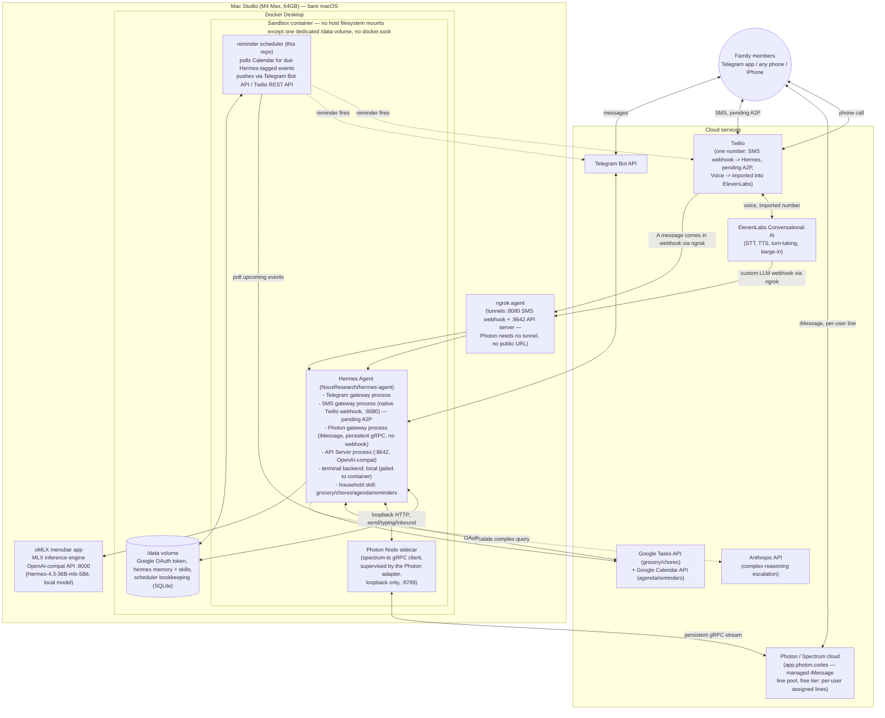

# Hermes Family Assistant — Architecture Plan

## Context

`conductor` is currently an empty scaffold (just `README.md` + `pyproject.toml`, Python ≥3.12). The README is a project brief describing a household AI assistant ("HermesBot") reachable over Telegram, SMS, and phone calls, built on **Hermes Agent** (NousResearch/hermes-agent), a real open-source agent framework, plus **oMLX** (omlx.ai), a real local-inference server for Apple Silicon. I confirmed both projects exist and pulled their actual capabilities from their docs rather than guessing, since the README's tech names map to specific real products with specific constraints.

Correcting my first pass: **Hermes Agent natively supports SMS via Twilio**, not just Telegram/Discord/Slack/etc. That removes the need for most of the custom "bridge" code I originally planned — the only genuinely custom software this project needs is the household data skill and a small reminder scheduler.

This plan defines the system architecture, component responsibilities, tech stack, and the external accounts to create before implementation starts. No code is written in this phase.

**Sources consulted:** [Hermes Agent docs](https://hermes-agent.nousresearch.com/docs/), [Hermes Agent GitHub](https://github.com/NousResearch/hermes-agent), [Hermes SMS docs](https://hermes-agent.nousresearch.com/docs/user-guide/messaging/sms), [Hermes API Server docs](https://hermes-agent.nousresearch.com/docs/user-guide/features/api-server), [Hermes Configuration docs](https://hermes-agent.nousresearch.com/docs/user-guide/configuration), [oMLX](https://omlx.ai/), [Hermes Agent × ElevenLabs integration article](https://youmind.com/landing/x-viral-articles/call-hermes-agent-eleven-agents).

---

## Key facts that shape the design

- **Hermes Agent** natively speaks Telegram, Discord, Slack, WhatsApp, Signal, Email, CLI, **and SMS via Twilio**. Each is its own gateway process (`hermes gateway ...`), started independently but sharing the same `~/.hermes` config/memory/skills. SMS runs Hermes's own webhook server (default port 8080, path `/webhooks/twilio`), strips markdown, splits messages over 1600 chars, and requires an explicit user allowlist.
- The one channel Hermes does **not** natively speak is **real-time phone voice**. For that, Hermes exposes an **API Server mode** (`hermes gateway`, OpenAI-compatible, default port 8642, bearer-token auth) — the full agent (memory, skills, tools) as a plain `/v1/chat/completions` endpoint. ElevenLabs' Conversational AI platform calls this directly as its "custom LLM," so Hermes still does 100% of the reasoning/tool-calling; ElevenLabs only owns the audio layer (STT, TTS, turn-taking, barge-in).
- Hermes takes cloud models as first-class providers (`model.provider: anthropic`, etc.) and a separate `auxiliary:` block for secondary/side-task models. There's no automatic complexity-based router — "local for routine, cloud for complex" means: **primary model = local via oMLX**, and a specific skill/tool path escalates to Anthropic when the agent (or a rule) decides a query needs it.
- Hermes's own terminal/execution backend supports `local`, `docker`, `ssh`, `singularity`, `modal`, `daytona` — but running Hermes's `docker` backend *inside* our sandbox container would require mounting the host Docker socket in, which defeats the sandboxing goal. **One sandbox boundary, not two**: outer container = the jail, Hermes's internal terminal backend = `local` (scoped to that already-jailed filesystem).
- **oMLX** is a signed/notarized macOS menubar app, not a container — it must run bare-metal to get Metal/GPU access, exposing `http://127.0.0.1:8000/v1` (OpenAI- and Anthropic-compatible) by default (configurable).

---

## Architecture

### Component responsibilities

| Component | Runs where | Responsibility |
|---|---|---|
| **oMLX** | Bare-metal macOS (menubar app) | Serves the local model over an OpenAI-compatible API using Metal/GPU acceleration. Handles routine, private household queries by default. |
| **Hermes Agent — Telegram gateway** | Sandbox container | Native process for the Telegram bot: tool-use routing, skills, memory, markdown, group chat. |
| **Hermes Agent — SMS gateway** | Sandbox container | Native process handling Twilio's "message comes in" webhook directly (own webhook server on :8080). No custom code needed here at all. **Pending A2P 10DLC registration (in progress offline) — not yet live.** |
| **Hermes Agent — Photon gateway (iMessage)** | Sandbox container | Native process; persistent gRPC connection to Photon's Spectrum cloud via the Node sidecar — no webhook, no public URL, no ngrok. Free tier: each family member is registered individually (`hermes photon setup --phone <E.164>`) and gets their own assigned iMessage line from Photon's shared pool, not one shared household number. |
| **Photon Node sidecar** | Sandbox container, loopback :8789 | Small supervised Node process running the `spectrum-ts` SDK (TypeScript-only) — bridges the Python gateway to Photon's gRPC stream. Started/restarted/killed by the Python adapter; never invoked directly. |
| **Hermes Agent — API Server** | Sandbox container, :8642 | Exposes the same agent as an OpenAI-compatible endpoint — the integration seam for ElevenLabs voice. |
| **household skill** (custom, agentskills.io-standard) | Loaded by Hermes | Tools: `add_grocery_item`, `list_groceries`, `log_chore`, `get_agenda`, `add_calendar_event`, `set_reminder`, etc. Grocery list and chores map to **Google Tasks** lists; agenda/events/reminders map to **Google Calendar** — both via OAuth, so identical state regardless of which channel was used, and family members can also see/edit it directly in Google's own apps. |
| **Google Tasks + Calendar API** | Cloud | The actual list/calendar backend behind the household skill. Official OAuth APIs, works with personal Gmail accounts (unlike the Google Keep API, which is Workspace-only). |
| **reminder scheduler** (custom, this repo) | Sandbox container, companion process | The one piece of proactive-push logic nothing else provides: Google Calendar can notify the account owner, but it can't push into Telegram/SMS. The scheduler polls Calendar for upcoming Hermes-tagged events and pushes them out via Telegram Bot API or Twilio REST API, then marks them sent. |
| **ElevenLabs Conversational AI** | Cloud | Owns the real-time voice layer end-to-end: STT, ultra-realistic TTS, turn-taking, barge-in. Its "custom LLM" endpoint points at Hermes's API Server (via ngrok) — Hermes does all the reasoning/tool-calling, ElevenLabs never touches household data directly. |
| **ngrok** | Host (or a thin sidecar) | Public HTTPS tunnel(s) terminating at the container's SMS-webhook port (:8080) and API Server port (:8642), since Twilio and ElevenLabs both need a public URL to reach the sandboxed container. **Not used by Photon** — its gRPC connection is outbound-only from the sidecar, no inbound public endpoint required. |
| **Docker** | Host | The single sandbox boundary. No bind mount of `~/Documents`, iCloud Drive, Time Machine, or any host user directory — only the dedicated `/data` volume. No Docker socket mounted in. |

### How each README scenario maps onto this

- **Scenario 1 (Telegram group)** — Telegram → Hermes Telegram gateway (native) → household skill → Google Tasks → markdown reply.
- **Scenario 2 (Voice, barge-in)** — Twilio Voice (number imported into ElevenLabs) → ElevenLabs owns audio + barge-in → custom-LLM callback → Hermes API Server (via ngrok) → household skill → response text → ElevenLabs TTS.
- **Scenario 3 (SMS fallback)** — Twilio SMS webhook → ngrok → Hermes's native SMS gateway → household skill → Hermes sends the TwiML/REST reply itself. No custom bridge code. **Pending A2P 10DLC registration** (started offline, days-long carrier process) — see Decision 6. In the meantime, **iMessage via Photon** serves as the interim text channel for Apple-device family members: no ngrok/webhook needed (persistent gRPC), but it doesn't fully satisfy this scenario's "no smartphone data plan" framing (iMessage requires an iPhone) — true SMS remains the target once A2P clears.
- **Scenario 4 (sandboxed script execution)** — Hermes's `terminal: local` backend runs *inside* the already-jailed container; no host directory is ever mounted in.

---

## Decisions (resolved)

1. **Cloud LLM provider:** **Anthropic**. Native first-class provider in Hermes (`model.provider: anthropic` + `ANTHROPIC_API_KEY`) — wired in as the escalation target for complex reasoning, no custom `base_url` needed.

2. **Local model recommendation:** ~~Hermes-4-14B, MLX 8-bit quantization~~ **superseded — see Phase 2 update below.** Original reasoning kept for the record:
   - It's Nous Research's own agentic/tool-calling fine-tune — the same team that builds Hermes Agent — so its function-calling behavior is a strong match for Hermes's tool-use routing.
   - 14B at 8-bit is ≈15GB resident, comfortably inside your 64GB unified memory budget alongside macOS, Docker, and a large context window/KV cache — with real headroom left over, unlike a 32B-class model at 8-bit (~35GB+) which would leave the system tight once Docker and context are added.
   - Sits centrally in the README's stated 12B–32B target range rather than pushing the top of it.
   - **Alternative** if you want a stronger generalist at the cost of more memory headroom: a ~27B–32B dense or MoE model (e.g. current Qwen3.x-class 4-bit MLX build, ~18–20GB) — worth A/B testing against Hermes-4-14B once both are running, but start with Hermes-4-14B.

   **Update (Phase 2, 2026-07-25):** Hermes-4-14B-8bit's native context window is 40,960 tokens (`max_position_embeddings` in its `config.json` — this is the model's real ceiling, not an oMLX under-report). Hermes Agent hardcodes `MINIMUM_CONTEXT_LENGTH = 64_000` (`agent/model_metadata.py`) and refuses to start below it, so Hermes-4-14B is disqualified outright — this wasn't visible until Phase 2 tried an actual `hermes -z` call against it.
   - **Local model, revised: Hermes-4.3-36B-mlx-5Bit** — newly downloaded, native context 524,288 (well clear of the floor), confirmed working end-to-end from inside the sandbox container in Phase 2.
   - **Next comparison point:** **Qwen3.6-35B-A3B-MLX-6bit** — also newly downloaded, 262,144 native context, MoE (~3B active params/token, so inference cost tracks closer to a small model despite the 35B total). This was the plan's original "Alternative" line, now promoted to a real A/B candidate against Hermes-4.3-36B rather than against the disqualified Hermes-4-14B. Not yet tested — planned for after Hermes-4.3-36B is exercised through Phase 3+.

3. **Voice bridging pattern:** Import the Twilio number directly into the ElevenLabs Agent (simplest — ElevenLabs owns the Voice webhook automatically).
   - **On your SMS question:** yes, this should still work. Twilio phone numbers have two *independent* webhook slots — "A call comes in" (Voice) and "A message comes in" (Messaging/SMS). ElevenLabs' number-import feature only configures the **Voice** slot; it has no reason to touch Messaging. So the same number can have its Voice webhook owned by ElevenLabs and its Messaging webhook pointed at Hermes's native SMS gateway (via ngrok) at the same time.
   - **One verification step to do at implementation time:** after importing the number into ElevenLabs, open the Twilio Console for that number and confirm the Messaging webhook is still set (or set it) to Hermes's SMS webhook URL — don't assume the import left it alone without checking.

4. **Process layout:** One container. Hermes's Telegram gateway, SMS gateway, and API Server all run as separate processes inside a single sandbox container, sharing one `~/.hermes` config/memory/skills directory and the mounted `/data` volume. The reminder scheduler runs as a fourth lightweight companion process in the same container. Hermes never runs on the bare host — the Docker sandbox from Scenario 4 is non-negotiable, so it's the environment used from the very first working Hermes setup, not bolted on afterward.

5. **Household data backend:** **Google Tasks + Google Calendar** (official OAuth APIs) instead of Google Keep or a local-only SQLite store.
   - Google Keep's *official* API exists but is restricted to Google Workspace (Business/Enterprise/Education) accounts — it doesn't work with a personal Gmail account. The unofficial `gkeepapi` library works with personal accounts but is reverse-engineered, unsupported by Google, can break without notice, and requires storing Google account credentials inside the sandbox — in tension with the README's own privacy/security priority.
   - Google Tasks (lists/checklists) and Google Calendar (events/agenda) are official, OAuth-based, fully supported on personal Gmail, and let family members see/edit the same data in apps they already use.
   - Trade-off accepted: this means the household data itself lives in Google's cloud, not purely locally — a deliberate deviation from "keep private household data local" in exchange for reliability and using tools the family already has. If fully local storage turns out to matter more once this is running, the household skill can be swapped back to local SQLite later without touching any other component.

6. **Phase 4 messaging channel: Photon (iMessage, free tier) now, Twilio SMS deferred.** (2026-07-25)
   - The Twilio number acquired for SMS turned out to need **A2P 10DLC carrier registration** before it can reliably send outbound messages (inbound is generally unaffected, but replies risk silent carrier filtering without it). Registration was started, but is a days-long offline process — not something to block Phase 4 on.
   - Explored two Hermes-native alternatives for the interim: **BlueBubbles** (self-hosted, runs on your own Mac, fully local data flow) and **Photon** (managed cloud service, `photon.codes`). BlueBubbles was ruled out because it bridges through whatever Apple ID is already signed into Messages.app on the host Mac — the user actively uses iMessage on that machine and didn't want to give Hermes that identity or sign out of their own account.
   - **Photon free tier chosen**, with a real limitation surfaced and accepted: Photon's free/Pro tiers use a **shared iMessage line pool** — each family member is individually registered (`hermes photon setup --phone <E.164>`) and assigned their *own* number from the pool, not one shared household number. A single dedicated number that the whole household texts requires Photon's **Business tier ($250/line/month)** — judged disproportionate for this project and explicitly rejected. Consequence: onboarding a new family member is manual (the operator runs the CLI, then hands that person their assigned number out of band) rather than self-serve like Telegram's public bot username.
   - Photon needs no ngrok/public webhook at all (persistent outbound gRPC via a supervised Node sidecar) — architecturally simpler than both SMS and Voice in that respect.
   - Trade-off accepted, same category as Decision 5: Photon is a third-party cloud service mediating household messages, not fully local — a deliberate deviation from "keep private data local," accepted for the same reasons (reliability, avoiding reverse-engineered alternatives, avoiding real cost). **Twilio SMS remains the target for README Scenario 3's "no smartphone data plan" case** once A2P registration clears — Photon does not replace that use case, since iMessage requires an iPhone.

---

## Tech stack

- **Host OS/hardware:** macOS on Mac Studio M4 Max, 64GB unified memory
- **Local inference:** oMLX (omlx.ai) — bare-metal menubar app, OpenAI-compatible API on `:8000` (default, confirm on your install), running **Hermes-4.3-36B-mlx-5Bit** (superseded Hermes-4-14B-8bit in Phase 2 — see Decision 2 update; `Qwen3.6-35B-A3B-MLX-6bit` queued for A/B comparison)
- **Agent core:** Hermes Agent (`NousResearch/hermes-agent`), Python/uv-based, MIT licensed — Telegram, SMS, and API Server gateway processes
- **Cloud LLM (complex-reasoning escalation):** Anthropic, wired in as a native provider
- **Containerization:** Docker Desktop for Mac, docker-compose for the sandbox container and the shared `/data` volume
- **Custom code (this repo):** Python 3.12 — the household skill (agentskills.io standard) and the reminder scheduler process
- **Household data store:** Google Tasks API (grocery list, chores) + Google Calendar API (agenda, events, reminders), via OAuth; a small SQLite file on the Docker-managed `/data` volume for the reminder scheduler's own bookkeeping and Hermes's memory/skills state
- **Channels:**
  - Telegram Bot API (via BotFather token) — native Hermes gateway
  - Twilio Programmable SMS — native Hermes gateway — **pending A2P 10DLC registration** (Decision 6)
  - Photon (Spectrum SDK, free tier) — native Hermes gateway, managed iMessage — **active as of Phase 4**, interim channel while SMS registration is pending (Decision 6)
  - Twilio Programmable Voice, number imported into ElevenLabs
  - ElevenLabs Conversational AI (Agents Platform) — STT/TTS/turn-taking/barge-in, custom-LLM webhook into Hermes's API Server
- **Network ingress:** ngrok tunnel(s) exposing the container's SMS-webhook port (:8080) and API Server port (:8642) publicly. Photon needs no tunnel — persistent outbound gRPC only.

---

## Accounts to create

| # | Account | Why | Notes |
|---|---|---|---|
| 1 | **Telegram** (BotFather) | Create the household bot + token | Free, needs an existing Telegram account |
| 2 | **Twilio** | One SMS+Voice-capable phone number, Account SID/Auth Token | Same number serves both SMS (via Hermes) and Voice (via ElevenLabs). **SMS side blocked on A2P 10DLC registration** (in progress offline, days-long) — Voice use is unaffected. |
| 3 | **Photon** (`photon.codes`) | Managed iMessage integration, free tier | `hermes photon setup --phone <E.164>` per family member — device-login OAuth via browser, no payment needed on free tier. Re-run per person to onboard each family member individually (see Decision 6 for the per-user-number limitation). |
| 4 | **ElevenLabs** | Conversational AI (Agents Platform) API key | Confirm the plan tier includes phone/Twilio number import and enough conversational minutes |
| 5 | **ngrok** | Auth token; a **reserved/static domain is recommended** (paid) | A free ephemeral URL changes on every restart, breaking the Twilio/ElevenLabs webhook config each time. Not needed for Photon. |
| 6 | **Anthropic** | API key for the complex-reasoning escalation path | Standard Anthropic Console account + API key |
| 7 | **Google Cloud project** | OAuth client for Google Tasks API + Google Calendar API | Enable both APIs in Google Cloud Console, create an OAuth 2.0 client, complete the consent flow once against the family Gmail account (or a dedicated household Google account) to get a refresh token |
| 8 | **Hugging Face** (conditional) | Only if downloading a gated model | Hermes-4.3-36B-mlx-5Bit and Qwen3.6-35B-A3B-MLX-6bit were both downloaded directly through oMLX with no gating hit — not needed so far |

---

## Implementation Roadmap

Each phase is a working, demoable milestone — nothing is built until the layer under it is verified. Hermes runs in Docker starting with Phase 2 and never on the bare host; channels and integrations are then added one at a time so a failure is always traceable to the thing that just changed.

### Phase 1 — Local model foundation (no Hermes, no Docker yet) — ✅ COMPLETE (2026-07-25)
- Install oMLX on the Mac Studio, pull `NousResearch/Hermes-4-14B` MLX 8-bit build, load it. Confirm the port it's actually listening on (default `:8000`, but verify against your install rather than assuming).
- **Done when:** `curl http://127.0.0.1:8000/v1/chat/completions` returns a real completion from the host.
- **Verified:**
  - `lsof`/`ps` confirmed `omlx-server` listening on `127.0.0.1:8000` — the documented default held, no override needed.
  - `GET /v1/models` shows `Hermes-4-14B-8bit` loaded and served alongside several other local models (Kokoro TTS, Whisper/Parakeet STT, a few smaller Llama/Qwen models) — oMLX is hosting a multi-model menu, not just the one model, worth remembering for later phases (e.g. STT/TTS options already sitting on the same box).
  - `POST /v1/chat/completions` with model id `Hermes-4-14B-8bit` returned a real, coherent completion (2.9s, 32 completion tokens, `finish_reason: stop`).
  - Note for Phase 2 config: the model id to put in Hermes's `model.name` (once we point Hermes's `custom` provider at oMLX) is `Hermes-4-14B-8bit`, not the bare `Hermes-4-14B` used in the plan doc — oMLX suffixes the quant.
  - **Superseded in Phase 2:** `Hermes-4-14B-8bit` turned out to have a native 40,960-token context window, below Hermes Agent's hardcoded 64K minimum — it never actually got used past this smoke test. See Decision 2's Phase 2 update and Phase 2 below.

### Phase 2 — Hermes Agent core, in Docker from the start — ✅ COMPLETE (2026-07-25)
- Hermes never runs on the bare host (per Decision 4). Stand up the sandbox container per the architecture — `/data` volume only, no host directory mounts, no `docker.sock`, terminal backend `local` — and install/configure Hermes Agent inside it. Configure `model.provider: custom` / `base_url` pointing at oMLX via `host.docker.internal:8000`.
- Hold a conversation via `hermes chat` (or equivalent CLI) inside the container, with no channels, no skills, no cloud fallback wired in yet.
- **Done when:** the CLI agent answers questions from inside the container using *only* the local model, **and** `ls ~/Documents` (or similar) from inside the container confirms it cannot see the host filesystem — the Scenario 4 isolation guarantee, verified from day one rather than bolted on later.
- **Built:**
  - `Dockerfile` (repo root) — `debian:bookworm-slim`, non-root `hermes` user, official Hermes Agent install script (`hermes-agent.nousresearch.com/install.sh`) run non-interactively.
  - `docker-compose.yml` (repo root) — single named volume `hermes_data` mounted at `/home/hermes/.hermes` (this **is** the architecture doc's `/data` volume: config, memory, skills, and later the OAuth token + scheduler SQLite). No bind mounts of any host directory. No `docker.sock`. `host.docker.internal` reachable natively on Docker Desktop for Mac.
  - `docker/hermes-config.yaml` — `model.provider: custom`, `base_url: http://host.docker.internal:8000/v1`, `terminal.backend: local`.
- **Verified:**
  - `hermes doctor` inside the container confirmed the terminal backend itself, unprompted: *"Running inside a container — using local terminal backend (docker-in-docker is not configured by default)"* — matching Decision 4/the plan's "one sandbox boundary, not two" reasoning exactly.
  - First attempt (`Hermes-4-14B-8bit`) failed hard at `hermes -z`: `agent failed: Model Hermes-4-14B-8bit has a context window of 40,960 tokens, which is below the minimum 64,000 required by Hermes Agent`. Confirmed via the model's own `config.json` (`max_position_embeddings: 40960`) that this is the model's real ceiling, not a server under-report — so Hermes-4-14B was disqualified rather than patched around with a fake `model.context_length` override. See Decision 2 update.
  - User downloaded two replacement candidates directly into oMLX: `Hermes-4.3-36B-mlx-5Bit` (524,288 context) and `Qwen3.6-35B-A3B-MLX-6bit` (262,144 context). Switched config to `Hermes-4.3-36B-mlx-5Bit`.
  - `hermes -z "In one short sentence, what model are you and who is serving you?"` from inside the container returned: *"I am Hermes-4.3-36B-mlx-5Bit, and I am serving myself as I'm currently running on my own local provider."* — real completion, local model only, no channels/skills/cloud configured.
  - Isolation checks, all passed: `ls ~/Documents` → no such file or directory; `ls /var/run/docker.sock` → no such file or directory; `mount` shows only the container's own overlay filesystem, nothing from the host.
- **Carried into Phase 3+:** switched `docker/hermes-config.yaml` to `Qwen3.6-35B-A3B-MLX-6bit` and re-ran the same basic smoke test — `hermes -z "In one short sentence, what model are you and who is serving you?"` correctly returned *"I'm Hermes Agent, running on a Qwen3.6-35B-A3B-MLX-6bit model served via a custom provider."* Confirms the config swap path works cleanly (edit `docker/hermes-config.yaml` → `docker cp` into the running container's `~/.hermes/config.yaml`, no rebuild needed). The real A/B — tool-calling behavior under the household skill — still awaits Phase 6 (moved post-voice, see reordering note below); this was just a basic-chat sanity check. **Qwen3.6-35B-A3B-MLX-6bit is now the active configured model** pending that comparison.

**Reordering note (2026-07-25):** Household skill and reminder scheduler were originally Phases 3 and 5 — moved to Phases 6 and 7, after all three channels (Telegram, SMS, Voice) are proven with plain local-model conversation. Rationale: get the harder infrastructure integrations (especially ElevenLabs voice/barge-in) validated early against a known-good local model, before adding the custom household business logic on top. Consequence: Telegram/SMS/Voice's done-when criteria below now check channel plumbing only (message/call in, coherent reply out) — the household-data checks that used to live in each of those phases (grocery item via Telegram, grocery/calendar parity via SMS, "answer sourced from the household skill" via voice) are consolidated into a single cross-channel integration pass at the end of Phase 6, once household data actually exists to check. The reminder scheduler moved with the household skill since it has nothing to poll (no Google Calendar) until that phase runs.

**Channel substitution note (2026-07-25, Decision 6):** Phase 4's channel changed from SMS to iMessage via Photon — SMS itself split off into deferred Phase 4b, blocked on A2P 10DLC registration (external, days-long, in progress offline). Phase 6's cross-channel integration pass (below) checks Telegram + Photon + Voice for now; the SMS leg of that check gets folded in once Phase 4b unblocks, rather than holding up Phase 6.

### Phase 3 — Telegram integration (Scenario 1, channel plumbing only) — ✅ COMPLETE (2026-07-25)
- Create the bot via BotFather, configure Hermes's native Telegram gateway process, start it alongside the CLI-tested config.
- **Done when:** a real Telegram message gets a coherent reply generated by the local model — no household data involved yet, this is purely proving the gateway process works.
- **Built:**
  - Bot created via BotFather (`@FamilyConductorBot`); token + numeric allowed-user ID collected.
  - Repo-root `.env` (gitignored) holds `TELEGRAM_BOT_TOKEN` / `TELEGRAM_ALLOWED_USERS` as the source of truth; `docker/sync-env.py` merges it into the container's `~/.hermes/.env` in place (replacing commented template lines, preserving everything else) via `docker cp` + exec — no secret ever appears on a host command line or in shell history.
  - `docker-compose.yml`: added `sysctls: net.ipv6.conf.all.disable_ipv6=1`.
- **Verified / debugged:**
  - First connection attempts appeared to hang forever at "Connecting to Telegram (attempt 1/8)…" with no further console output. Root-caused to **two separate issues**, not one:
    1. **Real bug:** the container's default Docker Desktop bridge network answers AAAA (IPv6) queries for external hosts but has no real IPv6 egress (`curl -6` failed instantly, `curl -4` worked). Fixed by disabling IPv6 at the kernel level inside the container (see Built, above) — matters for Twilio/ElevenLabs in later phases too, not just Telegram.
    2. **Test-harness artifact, not a real hang:** even after the IPv6 fix, `docker exec ... | timeout 90 hermes gateway run 2>&1` still only ever showed that one console line. The actual `~/.hermes/logs/gateway.log` proved the gateway connects successfully in ~11s every time ("Connected to Telegram (polling mode)") — the CLI's console rendering simply wasn't flushing further output through a non-TTY piped `docker exec`, before my `timeout` wrapper killed the process. Lesson: **trust `~/.hermes/logs/gateway.log`, not piped console output, when diagnosing this gateway.**
  - Started for real via `docker exec -d hermes-sandbox hermes gateway run`; `hermes gateway status` confirmed `✓ Gateway is running`.
  - **User sent a live Telegram message and confirmed a coherent reply** — Phase 3's done-when, met with a real phone, not just `hermes -z`.
  - Reviewed the actual authorization source (`gateway/authz_mixin.py`) rather than trusting docs alone: `TELEGRAM_ALLOWED_USERS` is enforced at message intake, *before* the agent/LLM/tools are invoked — an unauthorized sender is logged and dropped, never reaching the local model or household data. Noted for later: group chats need `TELEGRAM_GROUP_ALLOWED_CHATS` (a separate variable) once the bot joins the family group; the framework's separate "DM pairing" self-enroll path exists but is unused and unaudited — flagged for the Phase 9 hardening pass, not a blocker now.

### Phase 4 — iMessage integration via Photon (Scenario 3 interim, channel plumbing only) — ✅ COMPLETE (2026-07-25)
- **Replaces SMS as the Phase 4 channel** — see Decision 6. Twilio's number needs A2P 10DLC carrier registration before it can reliably send outbound SMS; registration was started offline (days-long process) and SMS itself moves to Phase 4b below, to be picked up whenever that clears.
- Run `hermes photon setup --phone <E.164>` (device-login OAuth via browser, provisions the Photon project, registers the operator's number, installs the Node sidecar). No ngrok/webhook needed — persistent gRPC.
- **Done when:** a real iMessage to the operator's assigned Photon line gets a coherent reply generated by the local model — no household data involved yet, same plumbing-only bar as Telegram/SMS.
- **Built / debugged:**
  - The `photon-platform` bundled plugin ships **disabled by default** (`hermes plugins list` showed `not enabled`). `hermes plugins enable photon-platform` appeared to work but actually wrote the wrong key to `config.yaml` (`platforms/photon` instead of the real manifest key `photon-platform`) — confirmed via `HERMES_PLUGINS_DEBUG=1`, which showed the plugin being skipped with `not in plugins.enabled` until the key was hand-corrected. Root cause looks like a bug in the enable command's key resolution, not something we misconfigured.
  - Even after the plugin loaded correctly (`Registered deferred platform loader: photon`), the standalone `hermes photon setup --phone <E.164>` CLI subcommand still failed with `invalid choice: 'photon'` — the platform registration and the CLI-subcommand registration are two separate calls in the plugin's `register(ctx)`, and only the first one was taking effect. Worked around it via the documented alternate path: `hermes gateway setup`, the unified onboarding wizard, which does surface Photon correctly.
  - `hermes gateway setup` is a full-screen interactive TUI (raw-mode ANSI, arrow-key navigation) with no non-interactive/scriptable mode. Installed `tmux` in the container and drove it programmatically — `tmux new-session -d`, `send-keys` for navigation/selection/text entry, `capture-pane` to read state after each step — the same loop a human would run, just scripted.
  - First device-login code expired before it could be approved (Photon's device-flow codes are short-lived); the wizard doesn't reissue a new code on retry within the same failed attempt, so the fix was starting a **fresh** `hermes gateway setup` run to get a new code, approved promptly on the second try.
  - Setup completed all 5 steps: device login → project created → Spectrum credentials provisioned → phone registered (confirmed already-registered from the user's prior Photon dashboard setup) → Node sidecar (`spectrum-ts`) installed via `npm ci`. `PHOTON_PROJECT_ID`/`PHOTON_PROJECT_SECRET`/`PHOTON_ALLOWED_USERS`/`PHOTON_HOME_CHANNEL` all landed in `~/.hermes/.env` correctly.
  - Restarted the gateway (`hermes gateway stop` then a fresh `hermes gateway run`) to pick up the new platform — `gateway.log` confirmed `✓ telegram connected`, `✓ photon connected`, sidecar listening on loopback `127.0.0.1:8789`, `Gateway running with 2 platform(s)`.
  - **User sent a live iMessage to the assigned Photon line and confirmed a coherent reply** — Phase 4's done-when, met with a real phone. (The assigned number itself isn't recorded here — treated as PII-adjacent like the operator's own phone number, not committed to this doc.)
- **Latency investigated, improvement deferred to Phase 9** — see that section below.

### Phase 4b — SMS integration (Scenario 3, deferred pending A2P 10DLC)
- **Not yet started — blocked on an external, days-long carrier registration process, not on any implementation work.** Deliberately not renumbered into the main sequence so later phases don't need to shift again once this becomes unblocked.
- Once A2P 10DLC registration clears: ngrok tunnel to the container's `:8080`, point the Twilio number's Messaging webhook at Hermes's native SMS gateway.
- **This will run after Phase 5 (Voice)**, on the *same* Twilio number Phase 5 configures for Voice — per Decision 3, Voice and Messaging are independent webhook slots on one number, but the ElevenLabs number-import step (Phase 5) only touches the Voice slot deliberately. When this phase resumes: **verify in the Twilio Console that the Voice webhook from Phase 5 is still pointed at ElevenLabs** before/after setting the Messaging webhook — don't assume configuring one slot leaves the other alone without checking.
- **Done when:** a text to the household number gets a plain-text reply from the local model, confirming the same functionality originally scoped for this slot.

### Phase 5 — Voice integration (Scenario 2, channel plumbing only) — ✅ COMPLETE (2026-07-26)
- Enable Hermes's API Server process (`:8642`), stand up an ElevenLabs Conversational AI agent, import the Twilio number's **Voice** webhook into ElevenLabs, point ElevenLabs' custom-LLM URL at Hermes's API Server via ngrok.
- **No SMS/Messaging overlap to check here** — Phase 4b (SMS) hasn't run yet, so this Twilio number has no Messaging webhook configured at all right now, and Phase 4's actual channel (iMessage) runs entirely through Photon's separate assigned number, never touching this Twilio number or the Twilio Console. The Decision-3 cross-check (confirm Voice import didn't clobber the Messaging webhook) now belongs to Phase 4b instead, since that's the phase running second on this number — see the note added there.
- **Done when:** a live phone call gets a spoken answer from the local model, and interrupting mid-response (barge-in) correctly cuts off TTS and registers the new turn — no household grounding yet, this proves the audio/turn-taking pipeline only.
- **Built:**
  - Verified ElevenLabs' custom-LLM contract before wiring anything up: requires SSE streaming (`Content-Type: text/event-stream`, `data: {json}\n\n` chunks, terminated by `data: [DONE]`), not a single JSON response. Confirmed Hermes's API Server already supports this (`chat_completions_streaming: true` in its own capabilities endpoint) — no gap to work around.
  - `.env`: `API_SERVER_ENABLED=true`, a generated `API_SERVER_KEY` (bearer token), `API_SERVER_PORT=8642`, `API_SERVER_HOST=0.0.0.0` (not the `127.0.0.1` default — has to accept Docker's forwarded traffic from the host, which doesn't arrive as true loopback inside the container).
  - `docker-compose.yml`: published `127.0.0.1:8642:8642` (host-loopback-only; ngrok runs on the host and is the only thing that needs to reach it).
  - Container recreated to pick up the port mapping; confirmed (again) that the named volume preserves every secret and config across recreation.
  - `ngrok http --domain=pumped-prawn-sadly.ngrok-free.app 8642`, run on the host.
  - Verified in order before touching ElevenLabs at all: (1) local curl with no auth → 401; (2) local curl with the bearer token → 200; (3) local curl with `stream:true` → correct SSE format; (4) the same request through the public ngrok URL → 200, confirming the full path end-to-end before ElevenLabs ever saw it.
- **ElevenLabs side (user-driven, dashboard UI):** free-tier account; Twilio number imported successfully (Telephony → Phone Numbers → Import from Twilio) and assigned to a new Conversational AI agent; agent's LLM set to Custom LLM with the ngrok Server URL, Model ID `hermes-agent`, and a secret named exactly `OPENAI_API_KEY` (ElevenLabs' own required literal name regardless of actual provider) holding the bearer token.
- **Debugged:**
  - First live test felt like ElevenLabs' own default LLM was still answering. Root-caused via ngrok's local request inspector (`127.0.0.1:4040/api/requests/http`), which captures full request/response bodies: the request genuinely reached Hermes (`AsyncOpenAI/Python` user agent, correct bearer token, `X-Hermes-Session-Id` in the response — proof only our server could have produced it), but ElevenLabs' agent had never had its "Agent character description" field filled in beyond the placeholder text `"Hi"`, and ElevenLabs wraps every request in its own boilerplate system-prompt template regardless. A blank persona plus boilerplate produces a generic-sounding reply indistinguishable from any other LLM, which is what created the false impression.
  - Confirmed from Hermes's own source (`gateway/platforms/api_server.py`) that any incoming `system`-role message is layered *on top of* Hermes's own core persona (SOUL.md) — there's no config flag to have the API Server ignore or replace an incoming system prompt. The fix had to happen on ElevenLabs' side.
  - **User cleared ElevenLabs' System Prompt field entirely — confirmed working.** Hermes's own persona now comes through in voice responses without ElevenLabs' template competing with it.
  - **User completed a real phone call test: works well, including barge-in.** Phase 5's done-when is met.
  - Separately surfaced (not fixed, deliberately deferred — see note below): on longer conversations, rapid-fire near-duplicate turns (ElevenLabs re-sending a request per interim STT transcript update, e.g. "...were president?" then "...were presidents?" moments apart) can pile up faster than Hermes+oMLX can answer, occasionally ending a call. Traced to each turn reprocessing a large fixed prompt overhead — one captured request showed `prompt_tokens: 16743` for input that was just the word "Hi", i.e. Hermes's full system prompt plus its entire tool-registration surface (dozens of tools: browser, kanban, terminal, image gen, etc.) gets sent to oMLX on every single turn regardless of whether any of it is relevant. **User's call: voice quality is already good enough and this isn't worth fixing under Phase 5's plumbing-only bar** — carried forward as the explicit first objective of Phase 6 (trim unneeded tools/prompt bloat) rather than a Phase 5 blocker, since it benefits every channel, not just voice.

### Phase 6 — Household skill v1: Google Tasks + Calendar, verified across all working channels
- **First objective, before any new tool is added: trim context/prompt bloat.** Surfaced during Phase 5 debugging — a request carrying just the word "Hi" showed `prompt_tokens: 16743`, because Hermes's full bundled tool registry (browser, kanban, terminal, image gen, dozens more, most never used by this project) gets sent to oMLX on every single turn across every channel, not just voice. Audit `hermes tools`/`hermes skills`/`hermes plugins list` for what's actually enabled, disable everything this household assistant doesn't need, and re-measure prompt size before adding the household skill's own tools on top of an already-bloated baseline. Benefits every channel (latency, and indirectly the Phase 9 Photon/voice latency investigations), not just the one that surfaced it. — ✅ **DONE (2026-07-26)**
  - `hermes tools list` showed 17 of 25 toolsets enabled by default, identically across every platform — nothing scoped to what this project actually needs.
  - Disabled 10 toolsets with no use case here: `browser`, `computer_use`, `image_gen`, `vision`, `tts` (ElevenLabs already owns TTS for voice), `delegation`, `session_search`, `skills` (gateway to the 69 bundled skills from install, almost none applicable), `web`, `cronjob` (Phase 7 builds its own scheduler). Kept `clarify`, `code_execution`, `file`, `memory`, `terminal`, `todo` — the last three specifically because README Scenario 4 (sandboxed script execution) is a real, demonstrated use case, not speculative.
  - Two rough edges hit along the way, consistent with the plugin-registration gaps found in Phase 4: (1) `hermes tools disable <name>` defaults to `--platform cli` only — silently leaves every other platform untouched unless you pass `--platform` explicitly per channel; (2) `photon` isn't a recognized platform name for this command at all (`Unknown platform 'photon'`), so its `platform_toolsets` block had to be added directly to `config.yaml` by hand — the runtime honors it fine even though the CLI can't write it.
  - `kanban` turned out to be a small always-on toolset that gets silently re-added any time the tool rewrites a platform's list, regardless of what's explicitly disabled — not worth fighting for one lightweight tool, left as-is.
  - **Result, measured, not assumed:** the same bare `"Hi"` request that cost 16,743 prompt tokens before now costs **6,357** via the API Server (a fresh measurement, not reusing the old ElevenLabs-wrapped one) — a 62% cut. Cross-checked via `hermes -z` (CLI platform): 6,864 input tokens, consistent. Gateway restarted cleanly afterward with all three live platforms (Telegram, Photon, API Server) reconnecting normally.
- Create the Google Cloud project, enable the Tasks and Calendar APIs, create an OAuth client, and complete the one-time consent flow to get a refresh token for the household skill to use.
- Build the custom household skill: `add_grocery_item`, `list_groceries`, `log_chore` (→ Google Tasks), `get_agenda`, `add_calendar_event`, `set_reminder` (→ Google Calendar), storing the OAuth token on the `/data` volume.
- Exercise it via `hermes chat` inside the container first, then re-verify through each already-working channel from Phases 3–5.
- **Done when:** items/events created through Hermes show up in the actual Google Tasks/Calendar apps and persist across separate sessions; **and**, as the integration pass this reordering deferred: "add milk to the grocery list" over Telegram shows up in Google Tasks, the same grocery/calendar state is visible whether written via Telegram or iMessage (Photon), and a live phone call gets a spoken answer sourced from the household skill. If Phase 4b (SMS) has landed by now, fold it into this same parity check; if not, revisit once it does.

- **Calendar half — ✅ DONE (2026-07-26); Tasks/grocery half still pending.**
  - **OAuth:** Google Cloud project + Calendar API enabled + Desktop OAuth client, consent flow completed via the bundled google-workspace skill's `scripts/setup.py`. Deliberately patched that script's (and `google_api.py`'s) hardcoded `SCOPES` list down to Calendar-only before requesting consent — the shipped default silently requests Gmail send/modify, Drive, Contacts, Sheets, and Docs too, which is far more access than this project needs. Round-trip tested (create event → read back via list) before moving on.
  - **Architecture change from the original plan:** initially tried driving the bundled google-workspace skill directly (the "hybrid" approach decided earlier — bundled skill for Calendar, custom code for Tasks). Abandoned that path for Calendar too, after live testing surfaced real failures — see below — and replaced it with `household/calendar_mcp_server.py` (this repo): a small stdio MCP server exposing `get_agenda`, `add_calendar_event`, `set_reminder` as direct tools, calling the Calendar API in-process. Registered via `hermes mcp add household --command <hermes-venv-python> --args .../calendar_mcp_server.py`. Runs on Hermes's own venv interpreter (already has `google-api-python-client` + `mcp` installed) and reuses the same OAuth token the skill's setup flow produced — no separate auth. Added to the Dockerfile as its own `COPY` layer, deliberately kept *outside* `~/.hermes` (the named volume) so a plain image rebuild actually updates it, unlike files placed inside the volume.
  - **Two real bugs found via live phone-call testing, both fixed:**
    1. The bundled skill's scripts assume a generic `python` on PATH with dependencies pre-installed. Neither holds in this container — no `python`/`python3` symlink exists (only a versioned `python3.11`, and even that resolves to the wrong, dependency-less uv-managed interpreter, not Hermes's own venv). Live call transcript showed the agent trying `python3` (`command not found`), then hitting pip's `externally-managed-environment` guard, then trying to **edit the skill itself** to fix it (blocked by a safety guard), then mistyping the skill name — a real, multi-step failure cascade, not a one-off glitch. The direct MCP tool sidesteps this entirely: no shell, no agent guesswork about interpreters, deterministic single call.
    2. Our own new MCP script initially resolved `HERMES_HOME` from the raw env var, which Hermes sets to something *other* than `~/.hermes` for spawned tool subprocesses — same mismatch, different cause. Found the authoritative resolution in the skill's own `_hermes_home.py` helper (`hermes_constants.get_hermes_home()`, importable from inside the venv) and matched that pattern instead of guessing.
  - **One false alarm, resolved without any code change:** after fixing both bugs, repeated `hermes -z` testing still seemed to fail on a plain "do I have any events Monday?" while succeeding when the tool was named explicitly — looked like a tool-discoverability problem. Root cause was `hermes -z`'s default session continuation: it kept replaying the model's *own earlier wrong claim* ("I don't have Python installed") from before the fixes landed, within the same continued session. A genuinely fresh session (tested directly via the API Server with a unique `X-Hermes-Session-Id`, matching what any real new phone call or new conversation actually gets) answered correctly and unprompted on the first try, twice, with different phrasing. Lesson: **don't use `hermes -z` for repeated fix-verify cycles on the same question** — it isn't stateless the way it looks; use a fresh session ID via the API directly instead.
  - **Not yet done:** Google Tasks (grocery list, chores) — needs its own OAuth scope added and a second small MCP tool alongside the calendar one. Full cross-channel parity check (Telegram, Photon, Voice, SMS-when-unblocked) per this phase's original done-when is still outstanding — calendar has only been verified via the API Server platform directly so far, not yet via a live call/text through the actual channels.

### Phase 7 — Reminder scheduler
- Build the companion scheduler process: polls Google Calendar for upcoming Hermes-tagged events, pushes a proactive message via Telegram Bot API when one comes due, and marks it sent (Google's own notifications can't reach Telegram/SMS, so this polling+push logic is unavoidable custom code).
- **Done when:** "remind me at 3pm to pick up Sam" results in an unprompted Telegram message at 3pm.

### Phase 8 — Cloud escalation (Anthropic)
- Add Anthropic as a provider in Hermes's config; decide and implement the escalation trigger (e.g. an explicit "complex reasoning" tool the agent invokes, or a manual per-conversation override) — see Decision 2's note that this isn't automatic. Added last since every channel needs to already be working to meaningfully test escalation from each of them.
- **Done when:** a deliberately complex query visibly routes to Anthropic while routine queries stay on the local model (check logs/latency to confirm which model answered) — tested from at least Telegram and voice.

### Phase 9 — Hardening & operational polish
- Lock down ngrok (reserved domain, auth), tighten Hermes's SMS/Telegram user allowlists, confirm secrets (Twilio, ElevenLabs, Anthropic, Google OAuth token) live only in `.env`/Docker secrets and are never committed, set container restart policies, and re-run the Scenario 4 isolation check as a final regression test.
- Add basic operational logging and confirm the Google Tasks/Calendar data (and the local scheduler-bookkeeping SQLite file) survive a container restart.
- **Photon iMessage latency reduction** (deferred from Phase 4, 2026-07-25): live testing showed most of the round-trip time is spent *before* Hermes ever sees the message, not in Hermes's own processing.
  - Diagnosis: added a temporary `logger.warning` in the container's `plugins/platforms/photon/adapter.py` (not committed — container-local debug patch) comparing Photon's own reported message timestamp to when our adapter actually receives the event. Across 4 samples: **8.9–14.1s** spent upstream of Hermes (Apple → Photon's managed cloud → gRPC → our sidecar) versus **3.3–6.8s** for Hermes's own local-model reasoning (oMLX). The bottleneck is clearly the Photon-cloud leg, not us.
  - Candidate fix explored: **self-hosted Spectrum** (`@spectrum-ts/imessage-local`) on a spare iMac — a dedicated machine + fresh Apple ID sidesteps the "don't want to use my personal Apple ID" issue that ruled out BlueBubbles (Decision 6), since it's not the Mac Studio's own login session. Plausible latency win (removes Photon's shared-tenant routing and the internet hop to their datacenter, replacing it with a LAN hop), but **not yet verified**: the plan would rely on the `PHOTON_SPECTRUM_HOST` config override to point our existing sidecar at the iMac's self-hosted Spectrum instance instead of `spectrum.photon.codes`, but it's unconfirmed whether a self-hosted instance speaks the same protocol/auth handshake as Photon's managed cloud — needs a real spike before committing setup time on the iMac. If that doesn't pan out, the fallback is custom bridge code between the iMac and Hermes, which we'd rather avoid (every other channel in this project uses a native Hermes gateway with zero custom bridge code).
  - **Done when (this sub-item):** either the `PHOTON_SPECTRUM_HOST` override is confirmed working against a self-hosted instance and round-trip latency is re-measured with the same diagnostic patch, or the investigation concludes it's not worth the added architecture and the managed free tier stays as-is.
- **Done when:** all four README scenarios pass in one continuous session without manual intervention, and the sandbox isolation check from Phase 2 still passes.
